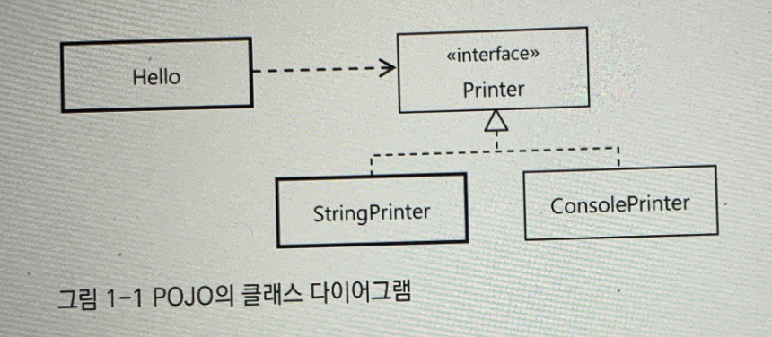

# 1장. IOC 컨테이너와 DI

[https://www.notion.so/1-IOC-DI-c4f233436f5e4891a97ca0372022817a](https://www.notion.so/1-IOC-DI-c4f233436f5e4891a97ca0372022817a)

**IOC/DI** : 사실상 자바의 표준 프로그래밍 모델

스프링 외에도, IOC/DI를 제공하는 것은 많지만, **스프링만큼 유연하고 강력한 기능을 가진 IOC 컨테이너와 DI 기술을 제공하는 것은 없다.**

# 1.1 IOC 컨테이터 : 빈 팩토리와 애플리케이션 컨텍스트

**스프링 어플리케이션**에서는 오**브젝트의 생성과 관계설정, 사용, 제거 등의 작업을 애플리케이션 코드 대신 독립된 컨테이너가 담당**.

이를 **컨테이너가 코드대신 오브젝트에 제어권을 갖고 있다**고 해서 **IOC** 라고 부른다.

### 스프링 컨테이너 = IOC 컨테이너

스프링에선 **IOC를 담당하는 컨테이너**를 **빈 팩토리 또는 애플리케이션 컨텍스트**라고 부른다.

오브젝트 생성과 오브젝트 사이의 런타임 관계를 설정하는 DI 관점으로 볼 때는 컨테이너를 빈 팩토리라고 한다. 

그런데 스프링 컨테이너는 단순한 DI 작업보다 더 많은 일을 한다.

DI를 위한 빈 팩토리에 엔터프라이즈 애플리케이션을 개발하는 데 필요한 여러 가지 컨테이너 기능을 추가한 것을 애플리케이션 컨텍스트라고 부른다.

애플리케이션 컨텍스트는 그 자체로도 IOC와 DI를 위한 빈 팩토리이면서 그 이상의 기능을 가졌다고 보면 된다.

스프링의 IOC컨테이너는 일반적으로 애플리케이션 컨텍스트를 말한다.

```java
public interface ApplicationContext extends ListableBeanFactory,
  HierarchicalBeanFactory, MessageSource, ApplicationEventPiblisher,
  ResourcePatternResolver {
```

= ApplicationContext 인터페이스를 구현한 클래스의 오브젝트

= 스프링 컨테이너  또는 IOC컨테이너라고 말하는 것은 바로 이 ApplicationContext 인터페이스를 구현한 클래스의 오브젝트다. 

스프링 애플리케이션은 최소한 하나 이상의 IoC컨테이너, 즉 애플리케이션 컨텍스트 오브젝트를 가지고 있다. 하나 이상이라고 하는 이유는 한 개 이상의 애플리케이션 컨텍스트 오브젝트를 갖고 있는 경우도 많기 때문이다.

## 1.1.1 IoC컨테이너를 이용해 애플리케이션 만들기

간단하게 IOC 컨테이너 만드는 법 : ApplicationContext 구현 클래스의 인스턴스를 만드는 것

```java
StaticApplicaionContext ac = new StaticApplicationContext();
```

→ 빈 컨테이너

이러한 빈 컨테이너를 본격적인 IOC 컨테이너로 동작하게 하려면 **POJO 클래스와 설정 메타정보** 두가지가 필요하다. 

### POJO 클래스

: 애플리케이션의 핵심 코드를 담고 있다.

: 각각의 POJO는 특정 기술과 스펙에서 독립적일뿐더러 의존관계에 있는 다른 POJO와 느슨한 결합을 갖도록 만들어야 한다.

: POJO 코드를 설계할 때는 일단 유연한 변경 가능성을 고려해서 만든다.



### 설정 메타정보

만든 POJO 클래스 들 중에 애플리케이션에서 사용할 것을 선정하고 이를 IoC컨테이너가 제어할 수 있도록 적절한 메타정보를 만들어 제공하는 작업이 필요하다.

IoC컨테이너의 가장 기초적인 역할은 오브젝트를 생성하고 이를 관리하는 것이다.

스프링 컨테이너가 관리하는 이런 오브젝트는 빈(bean)이라고 부른다.

IoC컨테이너가 필요로 하는 설정 메타정보는 바로 이 빈을 어떻게 만들고 어떻게 동작하게 할 것인가에 관한 정보다.

→ Bean : 스프링 컨테이너가 관리하는 오브젝트. 

    IoC컨테이너 : 가장 기초적인 역할은 Bean을 생성하고 이를 관리하는 것.
    
    설정 메타정보 : IoC컨테이너가 이 빈을 어떻게 만들고, 어떻게 동작하게 할 것인가에 대한 정보를 담고 있는 것.

- 스프링 설정 메타정보는 BeanDefinition 인터페이스로 표현되는 순수한 추상정보다.
- IoC 컨테이너(애플리케이션 컨텍스트는) 이 BeanDefinition으로 만들어진 메타정보를 담은 오브젝트를 사용해 IoC와 DI 작업을 수행한다.
- BeanDefinition는 파일의 제한을 받지않고 으로 정의되는 스프링의 설정 메타정보의 내용을 표현한 것이 있다면 무엇이든 사용 가능하다.
- 원본의 포맷과 구조, 자료의 특성에 맞게 읽어와 BeanDefinition 오브젝트로 변환해주는 BeanfinitionReader가 있으면 된다.

<BeanDefinition 인터페이스로 정의되는, IoC컨테이너가 사용하는 메타정보>

- 빈 아이디, 이름, 별칭 : 빈 오브젝트를 구분할 수 있는 식별자
- 클래스 또는 클래스 이름 : 빈으로 만들 POJO 클래스 또는 서비스 클래스 정보
- 스코프 : 싱글톤, 프로토 타입과 같은 빈의 생성방식과 존재범위
- 프로퍼티 값 또는 참조 : DI에서 사용할 프로퍼티 이름과 값 또는 참조하는 빈의 이름
- 생성자 파라미터 값 또는 참조: DI에 사용할 생성자 파라미터 이름과 값 또는 참조할 빈의 이름
- 지연된 로딩 여부, 우선 빈 여부, 자동와이어링 여부, 부모 빈 정보, 빈팩토리 이름 등

> 즉, 스프링 애플리케이션 이란, POJO 클래스와 설정 메타정보를 이용해 IoC컨테이너가 만들어주는 오브젝트의 조합

## 1.1.2 IOC 컨테이너의 종류와 사용 방법

스프링이 제공하는 ApplicationContext

- staticAppicationContext : 이런 컨테이너가 있다는것만 기억하면 됨
- GenericApplicationContext : JUnit 테스트에서 자동생성하는 애플리케이션 컨텍스트
- GenericXmlApplicationContext : GenericApplicationContext + XmlBeanDifinitionReader
- WebApplicationContext : 가장 많이 사용

## 1.1.3 IoC컨테이너 계층구조

모든 애플리케이션 컨텍스트는 부모 어플리케이션 컨텍스트를 가질 수 있다. 

각자 독릭접으로 자신이 관리하는 빈을 갖고 있긴 하지만 DI를 위한 빈을 찾을 때는 부모 애플리케이션 컨텍스트의 빈을 모두 검색한다.

검색순서는 항상 자신이 먼저 이고, 그런다음 직계 부모 순서다.

계층구조를 이용하는 이유

- 한개 이상의 IoC컨테이너를 만들어두고 사용해야 할 경우
- 애플리케이션 컨텍스트가 공유하는 설정을 만들기위해서


## 1.1.4 웹 애플리케이션의 IoC 컨테이너 구성

### 서버가 동작하는 애플리케이션에서 스프링 IoC 컨테이너를 사용하는 방법.

: 웹 모듈 안에 컨테이너를 두거나, 엔터프라이즈 애플리케이션 레벨에 두는 방법이 있다

1. 웹 애플리케이션 안에 WebApplicationContext 타입의 IoC 컨테이너를 두는 방법
    - 스프링 애플리케이션의 요청을 처리하는 서블릿 안에서 만들어지는 것
    - 웹 애플리케이션 레벨에서 만들어지는 것

    ⇒ 일반적으로는 두가지 방법을 모두 사용해 컨테이너를 만든다.

### 웹 애플리케이션의 컨텍스트 계층 구조


- 일반적으로는 프론트 컨트롤러 역할을 하는 서블릿은 하나만 만들어 사용한다.

  ⇒ 이렇게 계층적으로 만드는 이유 : 전체 애플리케이션에서 웹 기술에 의존적인 부분과 그렇지 않은 부분을 구분하기 위해서.


: 언제든 간단히 웹 기술을 확장하거나, 변경, 조합해서 사용하기에 좋다. 그러므로 당장에는 스프링 서블릿 한가지만 사용한다고 해도 이런 계층구조로 만들어두는 것이 권장된다.

### 웹 애플리케이션 컨텍스트의 구성 방법

1. 서블릿 컨텍스트와 루트 애플리케이션 컨텍스트 계층 구조
2. 루트 애플리케이션 컨텍스트 단일 구조
3. 서블릿 컨텍스트 단일 구조

: 첫 번째 방법은 컨텍스트 계층구조를 만드는 것이고, 나머지 두 가지 방법은 컨텍스트를 하나만 사용하는 방법이다.

첫번째와 세번째 방법은 스프링 웹 기능을 사용하는 경우이고, 두번째 방법은 스프링 웹 기술을 사용하지 않을 때 적용 가능한 방법이다.

### 루트 애플리케이션 컨텍스트 등록

: 서블릿 이벤트 리스너를 이용

### 서블릿 애플리케이션 컨텍스트 등록

DispatcherServlet : web.xml에 등록해서 사용할 수 있는 평법한 서블릿. 여러개 등록 가능. 

각 DispatcherServlet은 서블릿이 초기화 될 때 자신만의 컨텍스트를 생성하고 초기화 한다. 

DispatcherServlet을 등록할 때 신경 써야 할 사항은 다음 두가지다.

- <servlet-name>
- <load-on-startup>

# 1.2 IoC/DI를 위한 빈 설정 메타정보 작성

**IoC컨테이너의 가장 기본적인 역할** : 코드를 대신해서 애플리케이션을 구성하는 오브젝트를 생성하고 관리하는 것. : POJO로 만들어진 애플리케이션 클래스와 서비스 오브젝트들이 그 대상. 

이렇게 컨테이너가 빈이라고 불리는 오브젝트를 만들고 관리하게 하는 것이 DI를 비롯한 스프링의 주요 기술을 적용하기 위한 전제조건이다.

IoC컨테이너가 직접 사용하는 **BeanDifinition**은 순수한 오브젝트로 표현되는 빈 생성정보다.


## 1.2.1 빈 설정 메타정보


## 1.2.2 빈 등록 방법

5가지.

- XML: <Bean> 태그
- XML: 네임스페이스와 전용 태그
- 자동인식을 이용한 빈 등록 : 스테레오 타입 애노테이션과 빈 스캐너
    
    - @Component : 스테레오 타입 애노테이션
- 자바 코드에 의한 빈 등록 : @Contifuration 클래스의 @Bean 메소드

     유용한 점: 1. 컨파일러나 IDE를 통한 타입 검증이 가능하다.

                     2. 자동완성과 같은 IDE 지원 기능을 최대한 이용할 수 있다.
    
                     3. 이해하기 쉽다.
    
                     4. 복잡한 빈 설정이나 초기화 작업을 손쉽게 적용할 수 있다.

- 자바 코드에 의한 빈 등록 : 일반 빈 클래스의 @Bean 메소드

## 1.2.3 빈 의존 관계 설정 방법

: DI를 위한 의존관계 메타정보를 작성하는 방법.

빈 의존관계 주입방법 : 8가지

- XML: <property>,<constructor-arg>
    - <property> : 수정자 주입
    - <constructor-arg> : 생성자 주입
- XML : 자동 와이어링 : 이름 혹은 타입을 통한 자동 와이어링
- XML : 네임 스페이스와 전용 태그
- 애노테이션: @Resource - 자바 클래스의 수정자뿐 아니라 필드에도 붙일 수 있다.
- 애노테이션 : @Autowired/@Inject - 타입에 의한 자동와이어링 방식
- @Autowired와 getBean(), 스프링 테스트
- 자바코드에 의한 의존 관계 설정 : @configuration, @Bean

## 1.2.4 프로퍼티 값 설정 방법

DI를 통해 빈에 주입 되는 두가지

1. 다른 빈 오브젝트의 레퍼런스

2. 단순 값

### 설정 방법

- XML : <property>와 전용 태그 (value)
- 애노테이션 : @Value
- 자바 코드 : @Value
- 컬렉션 : 스프링은 List,Set,Map,Properties와 같은 컬렉션 타입을 XML로 작성해서 프로퍼티에 주입하는 방법을 제공 : value 애트리뷰트를 통해 스트링 값을 넣는 대신 컬렉션 선언용 태그를 사용해야 한다.

      ex) <list><set><map>

- Null과 빈문자열
    - 빈문자열 : value :""
    - null은 <null />로 선언
- 프로퍼티 파일을 이용한 값 설정

## 1.2.5 컨테이너가 자동 등록하는 빈

스프링 컨테이너는 초기화 과정에서 몇가지 빈을 기본적으로 등록해준다. 자주 사용하지는 않지만 간혹 필요하고 있으니 기억해두면 된다.

ApplicationContext,BeanFactory

ResourceLoader, ApplicationEventPublisher

SystemProperties, systemEnvironment : 스프링 컨테이너가 직접 등록하는 빈 중에서 타입이 아니라 이름을 통해 접근할 수 있는 빈

# 1.3 프로토 타입과 스코프

기본적으로 스프링의 빈은 싱글톤으로 만들어진다.

> 스코프 : 존재할 수 있는 범위를 가리키는 말이다. 빈의 스코프는 빈 오브젝트가 만들어져 존재할 수 있는 범위다. 빈 오브젝트의 생명주기는 스프링 컨테이너가 관리하기 때문에 대부분 정해진 범위의 끝까지 존재한다.
싱글톤 스코프 = 컨테이너 스코프 
: 단일 컨테이너 구조에서는 컨테이너가 존재하는 범위와 싱글톤이 존재하는 범위가 일치하기 때문이다.  
요청스코프는 하나의 요청이 끝날때까지만 존재한다.

## 1.3.1 프로토타입 스코프

싱글톤 스코프는 컨텍스트당 한 개의 빈 오브젝트만 만들어지게 한다. 따라서 빈을 여러 개 빈에서 DI하더라도 매번 동일한 오브젝트가 주입 된다.

### 프로토 타입 빈의 생명주기와 종속성

스프링이 관리하는 오브젝트인 빈은 그 생성과 다른 빈에 대한 의존 관계 주입, 초기화, DI와 DL을 통한 사용, 제거에 이르기 까지 모든 오브젝트의 생명주기를 컨테이너가 관리한다. 

빈에 대한 정보와 오브젝트에 대한 레퍼런스는 컨테이너가 계속 갖고 있고 필요할 때마다 요청해서 빈 오브젝트를 얻을 수 있다.

### 프로토 타입 빈의 용도

: 코드에서 new로 오브젝트를 생성하는 것을 대신하기 위해 사용 된다.

## 1.3.2 스코프

### 스코프의 종류

스프링이 기본적으로 세공하는 스코프 

- 싱글톤
- 프로토타입
- 요청 : 하나의 웹 요청안에서 만들어지고 해당 요청이 끝날 때 제거된다.
- 세션 : http 세션과 같은 존재 범위를 갖는 빈으로 만들어주는 스코프
- 글로벌세션 : 포틀릿에만 존재.
- 애플리케이션 : 서블릿 컨텍스트에 저장되는 빈 오브젝트. 서블릿 컨텍스트는 웹 애플리케이션 마다 만들어진다. 따라서 애플리케이션 스코프는 컨텍스트가 존재하는 동안 유지되는 싱글톤 스코프아 비슷한 존재 범위를 갖는다.

      → 따로 존재하는 이유는 웹 애플리케이션 밖에서 더 오랫동안 존재하거나, 더 짧은 동안 존재하는 서블릿 레벨의 컨텍스트가 있기 때문이다.

### 스코프 빈 사용 방법

[]()

Todo. ..(노션 용량 다써서 업데이트가 안됨..) 추가 업데이트 할 것 요기사진..

# 1.4 기타 빈 설정 메타정보

## 1.4.2 빈 생명 주기 메소드

### 초기화 메소드

- 초기화 콜백 인터페이스 : InitializingBean 인터페이스를 구현해서 빈을 작성하는 방법
- init-method 지정
- @PostConstruct
- @Bean(init-method)

### 제거 메소드

- 제거 콜백 인터페이스 : DisposableBean 인터페이스를 구현해서 destroy() 를 구현하는 방법.
- destroy-method
- @PreDestroy
- @Bean(destroyMethod)

## 1.4.3 팩토리 빈과 팩토리 메소드

**팩토리 빈** : 생성자 대신 오브젝트를 생성해주는 코드의 도움을 받아서 빈 오브젝트를 생성하는 것.

**팩토리 메소드**

- FactoryBean인터페이스
- 스태틱 팩토리 메서드
- 인스턴스 팩토리 메서드
- @Bean 메소드

# 1.5 스프링 3.1의 IoC 컨테이너와 DI

### 빈의 역할

1. 애플리케이션 로직빈과 애플리케이션 인프라 빈처럼 애플ㄹ리케이션이 동작하는 중에 사용되는 빈 : 애플리케이션을 구성하는 빈
2. 복합구조의 빈을 정의할 때 보조적으로 사용되는 빈 
3. <context:annotation-config> 같은 전용 태그에 의해 등록되는 컨테이너 인프라 빈 : 다른 애플리케이션 빈과 역할과 특성이 명확히 다르기때문에 이를 구분하고자 빈 메타정보의 속성을 통해 구분해둔 것. 

### 자바 코드를 이용한 컨테이너 인프라 빈 등록

- @ConponentScan
- @Import
- @ImportResource
- @EnableTransactionManagement