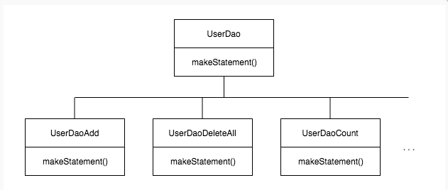

# 3장. 템플릿

[https://www.notion.so/3-fb0c4d919b2c4fd48f815424858ed85a](https://www.notion.so/3-fb0c4d919b2c4fd48f815424858ed85a)

복습

1방에서는 dao코드에 di를 적용해나가는 과정을 통해서 관심이 다른 코드를 다양한 방법으로 분리하고,

확장과 변경에 용이하게 대응할 수 있는 설계구조로 개선하는 작업을 했다.

개방 폐쇄 원칙(OCP) : 확장에는 자유롭게 열려 있고 변경에는 굳게 닫혀 있다는 객체지향 설계의 핵심 원칙

⇒ 코드에서 어떤 부분은 변경을 통해 그 기능이 다양해지고 확장하려는 성질이 있고, 어떤 부분은 고정되어 있고 변하지 않으려는 성질이 있음을 말해준다.

### 템플릿이란

이렇게 바뀌는 성질이 다른 코드 중에서 변경이 거의 일어나지 않으며 일정한 패턴으로 유지되는 특성을 가진 부분을 자유롭게 변경되는 성질을 가진 부분으로부터 독립시켜 효과적으로 활용할 수 있도록 하는 방법.

# 3.1 다시 보는 초난감 DAO

## 3.1.1 예외처리 기능을 갖춘 DAO

예외 처리 : 중간에 어떤 이유로든 예외가 발생했을 경우에도 사용한 리소스를 반드시 반환하도록 만들어야 한다.

### JDBC 수정 기능의 예외 처리 코드

일반적으로 서버에서는 제한된 개수의 DB 커넥션을 만들어서 재사용 가능한 풀로 관리한다.

DB 풀은 매번 getConnection()으로 가져간 커넥션을 명시적으로 close()해서 돌려줘야하지만 다시 풀에 넣었다가 다음 커넥션 요청이 있을 때 재사용할 수 있다.

그런데, 오류가 날 때마다 미처 반환되지 못한 connection이 계속 쌓이면 어느 순간에 커넥션 풀에 여유가 없어지고 리소스가 모자란다는 심각한 오류를 내며 서버가 중단될 수 있다.

* **리소스 반환과 close()

close()**의 의미는 **리소스 반환**
미리 정해진 풀 안에 제한된 수의 리소스(Connection,Statement)를 만들어두고 필요할 때 이를 할당하고, 반환하면 다시 풀에 넣는 방식으로 운영된다. 

요청이 매우 많은 서버 환경에서는 매번 새로운 리소스를 생성하는 대신 풀에 미리 만들어둔 리소스를 돌려가며 사용하는 편이 훨씬 유리하다. 대신, 사용한 리소스는 빠르게 반환해야 한다. 그렇지 않으면 풀에 있는 리소스가  고갈되고 결국 문제가 발생한다. 즉, close()는 사용한 리소스를 풀로 다시 돌려주는 역할 

JDBC 코드에서는 try/catch/finally 구문 사용을 권장 

```java
try{
} catch(SQLException e){
  throw e;
} finally{ //finally 이므로 try 블록에서 예외가 발생했을 때나 안 했을 때나 모두 실행 된다.

    //null 인지 확인 후 close, -> null 인데 close 하면 오히려 에러날 수 있음.
    //그래서 이부분도 try/catch로 한번 더 감싸줘서 로그를 찍어두면 좋음.  
}
```

### JDBC 조회 기능의 예외처리

close()는 만들어진 순서의 반대로 하는 것이 원칙이다.

# 3.2 변하는 것과 변하지 않는 것

## 3.2.1 JDBC try/catch/finally 코드의 문제점

try/catch/finally 문장은 close가 빠져도 catch/finally가 빠져도 블록이 빠져도 오류가 안남!!!

## 3.2.2 분리와 재사용을 위한 디자인 패턴 적용

변하는 부분과 변하지 않는 부분의 분리

### 메소드 추출

### 템플릿 메소드 패턴의 적용

**템플릿 메소드 패턴** : 상속을 통해 기능을 확장해서 사용하는 부분

변하지 않는 부분은 슈퍼클래스에 두고 변하는 부분은 추상 메소드로 정의해둬서 서브클래스에서 오버라이드 하여 새롭게 정의하여 쓰도록 하는 것.

 하지만 템플릿 메소드 패턴으로의 접근은 제한이 많다.

가장 큰 문제는 DAO 로직마다 상속을 통해 새로운 클래스를 만들어야 한다는 점. 



### 전략 패턴의 적용

**전략 패턴** : 오브젝트를 아예 둘로 분리하고 클래스 레벨에서는 인터페이스를 통해서만 의존하도록 만든 것.

: OCP 관점에서 보면 확장에 해당하는 변하는 부분을 별도의 클래스로 만들어 추상화된 인터페이스를 통해 위임하는 방식. 

템플릿 메소드 패턴보다 유연하고 확장성이 뛰어남. 


좌측에 있는 context의 contextMethod()에 일정한 구조를 가지고 동작하다가 특정 확장 기능은 strategy 인터페이스를 통해 외부의 독립된 전략 클래스 위임하는 것.

deleteAll() ⇒ contextMethod() 

**deleteAll()의 컨텍스트**

- DB 커넥션 가져오기
- PreparedStatement를 만들어줄 외부 기능 호출하기
- 전달받은 PreparedStatement 실행하기
- 예외가 발생하면 이를 다시 메소드 밖으로 던지기
- 모든 경우에 만들어진 PreparedStatement와 Connection을 적절히 닫아주기.

PreparedStatement를 만들어주는 외부 기능 ⇒ 전략

: 이 기능을 인터페이스로 만들어두고 인터페이스의 메소드를 통해 PreparedStatement 생성 전략을 호출해주면 된다.

```java
public interface StatementStrategy {
    PreparedStatement makePreparedStatement(Connection c) throws SQLException;
}
```

: 컨텍스트가 만들어둔 connection을 전달 받아서, PreparedStatement를 만들고 만들어진 PreparedStatement 오브젝트를 돌려준다. 

```java
public class DeleteAllStatement implements StatementStrategy {
    public PreparedStatement makePreparedStatement(Connection c) throws SQLException {
        PreparedStatement ps = c.prepareStatement("delete from users");
        return ps;
    }
}
```

: PreparedStatement를 생성하는 클래스 

```java
public void deleteAll() throws SQLException {
...
try {
        c = this.dataSrouce.getConnection();
        
        StatementStrategy st = new DeleteAllStatement();
        jdbcContextWithStrategy(st);
        
         ps.executeUpdate();
    } catch (SQLException e) {
}
```

: contextMethod에 해당하는 UserDao의 deleteAll() 메소드에서 위에 만들어둔 전략을 사용

그러나! OCP에도 맞게 DeleteAllStatement를 직접 알고 있지 않도록 변경 필요

### DI 적용을 위한 클라이언트/컨텍스트 분리

전략패턴의 context가 어떤 전략을 사용하게 할것인가는 client가 결정할 수 있도록 해야함.

client가 구체적인 전략의 하나를 선택하고 오브젝트로 만들어서 context에 전달하게 하는 것.

context는 전달받은 그 strategy 구현 클래스의 오브젝트를 사용한다.


DI 의 모습과 같음. 결국 DI는 전략 패턴의 장점을 일반적으로 활용할 수 있도록 만든 구조.

여기서 중요한 것은

JDBC try/catch/finally 코드를 클라이언트 코드인 StatementStrategy를 만드는 부분에서 독립시켜야 한다는 점.

```java
//클라이언트에 해당하는 부분 
public void deleteAll() throws SQLException {
    StatementStrategy st = new DeleteAllStatement();
    jdbcContextWithStrategy(st);
}

// 메소드로 분리한 try/catch/finally 컨텍스트 코드 
public void jdbcContextWithStrategy(StatementStrategy stmt) throws SQLException {
    Connection c = null;
    PreparedStatement ps = null;
    
    try {
        c = this.dataSrouce.getConnection();
        
        ps = stmt.makePreparedStatement(c);
        
        ps.executeUpdate();
    } catch (SQLException e) {
        throw e;
    } finally {
        if (ps != null) { try { ps.close(); } catch (SQLException e) {} }
        if (c != null) { try { c.close(); } catch (SQLException e) {} }
    }
}
```

:  비록 클라이언트와 컨텍스트는 클래스를 분리하진 않았지만, 의존관계와 책임으로 볼때 이상적인 클라이언트/컨텍스트의 관계를 갖고 있다. 특히 클라이언트가 컨텍스트가 사용할 전략을 정해서 전달하는 면에서 DI구조라고 이해할 수 있다.

⇒ 이를 통해서 본격적인 개선 작업이 가능해졌다~ 이제야~?

> 의존관계 주입(DI)의 가장 중요한 개념은 
제3자의 도움을 통해 두 오브젝트 사이의 유연한 관계가 설정되도록 만든다는 것.

**마이크로 DI란** 

클라이언트가 오브젝트 팩토리의 책임을 함께 지고 있을 때가 있다. 
또는 클라이언트과 전략이 결합될 수도 있다. 
심지어는 클라이언트와 DI 관계에 있는 두 개의 오브젝트가 모두 하나의 클래스 안에 담길 수도 있다.

이런 경우에는 DI가 매우 작은 단위의 코드와 메소드 사이에서 일어나서 DI 같아보이지 않지만,
이렇게 DI의 장점을 단순화해서 IOC 컨테이너의 도움 없이 코드 내에서 적용한 경우를 마이크로 DI라고 한다.
또는 코드에 의한 DI, 수동 DI라고 부를 수도 있다.