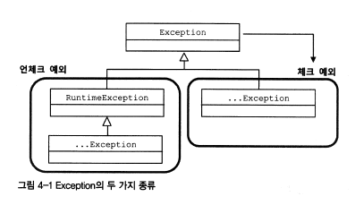

# 4장. 예외

[https://www.notion.so/4-908f82f8fc9c4bdc90de0b8d2670f279](https://www.notion.so/4-908f82f8fc9c4bdc90de0b8d2670f279)

# 4.1 사라진 SQLException

## 4.1.1 초난감 예외처리

### 예외 블랙홀

```java
try{
}
catch(SQLException e){
} // 예외를 잡고 아무것도 하지 않는다. 이런건 만들면 안되는 코드다 
```

```java
try{
}
catch(SQLException e){
   System.out.println(e)
} 
```

```java
try{
}
catch(SQLException e){
   e.printStackTrace();
}
```

위의 코드는 예제때도 하면 안되는 코드들이다

이유는 → 모니터링이 어렵고, 예외 처리가 되어있지 않은 단순 로그 이기때문 그리고 그냥 다음코드로 실행을 이어갈뿐이기 때문이다.

- [ ]  **모든 예외는 적절하게 복구되든지 아니면 작업을 중단시키고 운영자 또는 개발자에게 통보돼야 한다.**

### 무의미하고 무책임한 throws

⇒ 이건 자기를 호출한 메소드로 책임을 전가 시키는 것.

쓰인 의미가 명확하지 않고, 습관적인 throws는 좋지않다.

## 4.1.2 예외의 종류와 특징

### * Error

java.lang.Error 클래스의 서브클래스들.

비정상적인 상황이 발생했을 경우 사용

주로 자바 VM에서 발생시키는 것이기때문에 애플리케이션 코드에서 잡으려고 하면 안된다.

ex) OutOfMemoryError, ThreadDeath

### * Exception과 체크 예외

개발자들이 만든 코드에서 예외가 발생했을 경우 사용



**checked exception**  

- exception의 서브클래스이면서, RuntimeException 클래스를 상속하지 않은 것들.
- 체크 예외가 발생할 수 있는 메소드를 사용할 경우 반드시 예외 처리하는 코드를 함께 작성해야 한다.
- catch문으로 잡든지, 아니면 throws를 정의해서 메소드밖으로 던지던지하지않으면 컴파일 에러가 발생한다.

### * RuntimeException과 언체크/런타임 예외

**unchecked exception** = 런타임 예외

- RuntimeException 클래스를 상속한 클래스들
- 명시적인 예외처리를 강제하지 않는다.
- 주로 의도된 것들 ex) NullPointerException, illefalArgumentException(허용되지 않는 값을 사용해서 메소드를 호출할 때 발생)
- 피할 수 있지만 개발자가 부주의해서 발생할 수 있는 경우에 발생하도록 만든 것

## 4.1.3 예외 처리 방법

### 예외복구

: 예외상황을 파악하고 문제를 해결해서 정상 상태로 돌려 놓는 것, 다른 흐름으로 유도하는 것,재시도

### 예외처리 회피

자신을 호출한 쪽으로 던져버리는 것 = throw, rethrow(catch블럭안에서 던지는 것)

예외를 회피하는 것은 의도가 분명해야 한다.

### 예외 전환

(exception translation)

예외를 그대로 던지는 것이 아니라, 적절한 예외로 던지는 것. 

예외 전환의 목적

1. 의미를 분명하게 해줄 수 있는 예외로 바꿔주기 위해서 → 중첩예외로 만드는 것이 좋다. 

```java
catch(SQLException e){
   throw DuplicationUserIdException(e);
}
```

```java
catch(SQLException e){
   throw DuplicationUserIdException().initCause(e);
}
```

→ 중첩예외의 예제들.

2.  쉽고 단순하게 만들기 위해 포장하는 것

### 4.1.4 예외처리 전략

### 런타임 예외의 보편화

자바의 환경이 서버로 이동하면서 체크 예외의 활용도와 가치는 점점 떨어지고 있다. 자칫하면 throws Exception으로 점철된 아무런 의미도 없는 메소드들을 낳을 뿐이다. 그래서 대응이 불가능한 체크 예외라면 빨리 런타임 예외로 전환해서 던지는 게 낫다. 

그래서 요즘은 API가 발생시키는 예외를 언체크 예외로 만드는 경향이있다.

= runtimeException을 상속하게 한다.

= 복구시키게가 아닌, 그 작업은 중단하고 개발자에게 알려주도록 하는 것.

### add()메소드의 예외처리

```java
public calss DuplocateuserIdException extends RuntimeException{
   public DuplocateuserIdException(Throwable cause){
     super(cause);
   }
}
```

sql 에러는 잡아봣자, 처리할 것도 없고 복구할 것도 없는 예외이니 그냥 unchecked예외로 만들어 버리는 것.

⇒ 단 이럴 경우 주의할 점은, 컴파일러가 예외 처리를 강제하지 않으므로 신경쓰지않으면 예외상황을 충분히 고려하지 않을 수도 있기 때문에 더욱 주의를 기울여야 한다.

### 에플리케이션 예외

: 시스템 또는 외부의 예외상황이 원인이 아니라 애플리케이션 자체의 로직에 의해 의도적으로 발생시키고, 반드시 catch 해서 무엇인가 조치를 취하도록 요구하는 예외

ex) 통장에 잔고가 없는데 출금을하려하는 상황같은.

### 4.1.5 SQLExcpetion은 어떻게 됐나?

99%의 sqlExeption은 코드레벨에서는 복구할 방법이 없다. 

스프링 JdbcTemplate은 템플릿과 콜백안에서 발생하는 모든 sqlExeption을 DataAccessException으로 포장해서 던져준다. 

# 4.2 예외전환

## 4.2.1 JDBC의 한계

### 비표준 SQL

: jdbc 코드에서 사용하는 SQL

### 호환성 없는 SQLException의 DB 에러 정보

sqlException의 종류

- SQL 문법 오류
- DB 커넥션 에러
- 테이블 필드의 존재하지 않음
- 키가 중복
- 제약조건 위배
- 데드락
- 락을 얻지못했거나

등등등 수백가지

근데 문제는 DB마다도 또 다다름.

그런데 이 많은 에러를 하나의 Exception에 담는다.

DB마다 고유 에러코드가 있으니, 에러코드로 확인하지만 DB가 바뀔때마다 바꿔주어야 한다.

결국 SQLException 만으로 DB에 독립적인 유연한 코드를 작성하는 건 불가능하다. 

## 4.2.2 DB 에러코드 매핑을 통한 전환

각 DB별 에러 코드 매핑 파일을 이용해, 전부 알기 쉬운 에러로 던져주자


이런식으로 매핑 파일을 사용하고 나면

```java
catch(DuplicateKeyException e){
   throw DuplicationUserIdException().initCause(e);
}
```

이런식으로 에러를 잡을 수 있다.

## 4.2.3 DAO 인터페이스와 DataAccessException 계층 구조

JDO나 JPA는 JDBC와 마찬가지로 자바의 표준 퍼시스턴스 기술이지만 JDBC와는 성격과 사용 방법이 크게 다르다.

DataAccessException은 JDBC의 SQLException을 전환하는 용도로만 만들어진 건 아니다. JDBC 외에 자바 데이터 엑세스 기술에서 발생하는 예외에도 적용된다.

의미가 같은 예외라면 데이터 액세스 기술의 종류와 상관없이 일관된 예외가 발생하도록 만들어준다.

데이터 액세스 기술에 독립적인 추상화된 예외를 제공하는 것이다. 

스프링이 왜 이렇게 DataAccessException 계층구조를 이용해 기술에 독립적인 예외를 정의하고 사용하게 하는지 생각해보자 ← 생각해보자...!!!!!

### DAO 인터페이스와 구현의 분리

### 데이터 액세스 예외 추상화와 DataAccessException 계층 구조

스프링은 자바의 다양한 데이터 액세스 기술을 사용할 때 발생하는 예외들을 추상화해서 DataAccessException 계층 구조 안에 정리해 놓았다. 

```java
public abstract class DataAccessException extends NestedRuntimeException {

	/**
	 * Constructor for DataAccessException.
	 * @param msg the detail message
	 */
	public DataAccessException(String msg) {
		super(msg);
	}

	/**
	 * Constructor for DataAccessException.
	 * @param msg the detail message
	 * @param cause the root cause (usually from using a underlying
	 * data access API such as JDBC)
	 */
	public DataAccessException(@Nullable String msg, @Nullable Throwable cause) {
		super(msg, cause);
	}

}

//코드를 보니 이걸 상속하고 상속하고 상속해서 ... exception 을 만듬
//ex) import org.springframework.dao.EmptyResultDataAccessException;
```

p.308 그림도 참고

결론 : dao를 만들면 사용 기술에 독립적인 일관성 있는 예외를 던질 수 있고, 결국 인터페이스 사용, 런타입 예외전환과 함께 DataAccessException 예외 추상화를 적용하면 데이터 액세스 기술과 구현 방법에 독립적인 이상적인 DAO를 만들 수가 있다.

이래서 dao를 만드는 구나~

## 4.2.4 기술에 독립적인 UserDao 만들기

### 인터페이스 적용

```java
public interface UserDao
```

### 테스트 보완

### DataAccessException 활용 시 주의 사항

duplicateKeyException은 아직까지는 JDBC 를 이용하는 경우에만 발생한다.