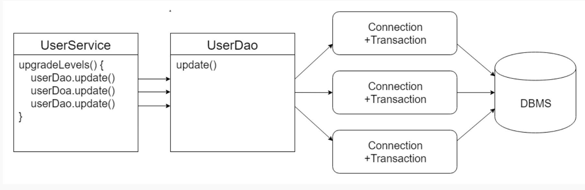

# 5장. 서비스 추상화

[https://www.notion.so/5-4b3d8f1cf3b24aef8b8e394ca294ab13](https://www.notion.so/5-4b3d8f1cf3b24aef8b8e394ca294ab13)

# 5.1 사용자 레벨의 관리 추가

## 5.1.1 필드 추가

### Level 이늄

```java
public enum Level {
BASIC(1), SILVER(2), GOLD(3);

}
```

## 5.1.5 코드 개선

- 코드에 중복된 부분은 없는가?
- 코드가 무엇을 하는 것인지 이해하기 불편하기 않은가?
- 코드가 자신이 있어야 할 자리에 있는가?
- 앞으로 변경이 일어난다면 어떤 것이 있을 수 있고, 그 변화에 쉽게 대응할 수 있게 작성되어 있는가?

user 테스트 ← 참고 

# 5.2 트랜잭션 서비스 추상화

## 5.2.1 모아니면 도

## 5.2.2 트랜잭션 경계 설정

DB는 완벽한 트랙잭션을 보장해준다.

하지만 여러개의 SQL이 사용되는 작업을 하나의 트랜잭션으로 취급해야하는 경우도 있다.

<DB의 트랜잭션 작업이 끝나는 방법의 두가지>

트랜잭션 롤백 : 하나의 SQL을 취소하면 앞에서 처리한 SQL 작업도 취소시켜야한다.

트랜잭션 커밋 : 모든 SQL 작업이 성공하면 수행작업이 마무리됐다고 DB에게 알려줘서 작업을 확정시켜야 한다.

### **JDBC 트랜잭션의 트랜잭션 경계설정**

모든 트랜잭션은 한 가지의 시작 지점과 두 가지의 끝나는 지점이 있다. 

**JDBC의 트랜잭션은 하나의 Connection을 가져와 사용하다가 닫는 사이에서 일어난다.**

트랜잭션의 시작과 종료는 Connection 오브젝트를 통해 이뤄지기 때문이다. 

JDBC에서 트랜잭션을 시작 : 

Connection의 setAutoCommit(false) :  자동커밋 옵션을 false로

트랜잭션이 한 번 시작되면 commit() 또는 rollbak() 메소드가 호출 될 때까지의 작업이 하나의 트랜잭션으로 묶인다.

이렇게 **setAutoCommit(false)로 트랜잭션의 시작을 선언하고 commit() 또는 rollback()으로 트랜잭션을 종료하는 작업을 트랜잭션의 경계설정Transaction Demarcation이라고 한다.** 

이렇게 하나의 DB 커넥션 안에서 만들어지는 트랜잭션을 **로컬 트랜잭션Local Tranaction**이라고도 한다.

### UserService와 UserDao의 트랜잭션 문제

일반적으로 트랜잭션은 커넥션보다도 존재의 범위가 짧다.

따라서 템플릿 메소드가 호출될 때마다 트랜잭션이 새로 만들어지고 메소드를 빠져나오기 전에 종료된다.

결국 JdbcTemplate의 메소드를 사용하는 UserDao는 각 메소드마다 하나씩의 독립적인 트랜잭션으로 실행될 수 밖에 없다.



### 비즈니스 로직 내의 트랜잭션 경계 설정

어느 정도 책임이 다른 코드를 분리해둔 채로 트랜잭션 문제를 해결할 수 있다.

트랜잭션의 경계를 upgradeLevels() 메소드 안에 두려면 DB 커넥션도 이 메소드 안에서 만들고, 종료시킬 필요가 있다. 결국 트랜잭션 경계 설정을 다음과 같은 구조로 만들어야 한다.

```java
public void upgradeLevels() throws Exception {
    (1) DB Connection 생성
    (2) 트랜잭션 시작
    try {
        (3) DAO 메소드 호출
        (4) 트랜잭션 커밋
    } catch (Exception e) {
        (5) 트랜잭션 롤백
        throw e;
    } finally {
        (6) DB Connection 종료
    }
}
```

위는 트랜잭션을 사용하는 전형적인 JDBC 구조이다.

유저 서비스에서 커넥션을 공유하게 하고, dao에서 커넥션을 받도록해야 한다.

### UserService 트랜잭션 경계설정의 문제점

1. JdbcTemplate을 더이상 활용할 수 없다는 점. JDBC API를 직접 사용하는 초기 방식으로 돌아가야 한다는 점. 
2. DAO의 메소드와 비즈니스 로직을 담고 있는 UserService의 메소드에 커넥션 파라미터가 추가돼야 한다는 점 
3. Connection 파라미터가 userService에 추가되면 Test도 생성하고, DAO에서 받아야 하는것

## 5.2.3 트랜잭션 동기화

그렇다면 트랜잭션 기능을 포기해야할까?

스프링은 이 딜레마를 해결할 수 있는 멋진 방법을 제공해준다.

### Connection 파라미터 제거

트랜잭션 동기화 : UserService에서 트랜잭션을 시작하기 위해 만든 Connection을 특별한 저장소에 보관해주고, 이후에 호출되는 DAO의 메소드에서는 저장된 Connection을 가져다가 사용하게 하는 것이다. 정확하게는 JdbcTemplate이 트랜잭션 동기화를 이용하게 하는 것이다.

 


## **트랜잭션 동기화 적용**

멀티스레드 환경에서 안전한 트랜잭션 동기화 방법을 구현하는 일이 기술적으로 간단하지 않지만 스프링은 JdbcTemplate과 더불어 트랜잭션 동기화 기능을 지원하는 간단한 유틸리티 메소드를 제공하고 있다.

```java
private DataSource dataSource;

public void setDataSource(DataSource data) {
    this.dataSource = dataSource;
}

public void upgradeLevels() throws Exception {
    TransactionSynchronizationManager.initSynchronization();
    Connection c = DataSourceUtils.getConnection(dataSource);
    c.setAutoCommit(false);
    
    try {
        List<User> users = userDao.getAll();
        for (User user : users) {
            if (canUgradeLevel(user)) {
                upgradeLevel(user);
            }
        }
        c.commit();
    } catch (Exception e) {
        c.rollback();
        throw e;
    } finally {
        DataSourceUtils.releaseConnection(c, dataSource);
        TransactionSynchronizationManager.unbindResource(dataSource);
        TransactionSynchronizationManager.clearSynchronization();
    }
}
```

**스프링이 제공하는 트랜잭션 동기화 관리 클래스는 TransactionSynchrinizationManager다.** 이 클래스를 이용해 먼저 트랜잭션 동기화 작업을 초기화 하도록 요청한다.

initSynchronization() 메소드를 통해 트랜잭션 동기화 작업을 초기화한 후, DataSourceUtils에서 제공하는 getConnection() 메소드를 통해 트랜잭션 동기화를 위해 저장소에 바인딩하며 DB 커넥션을 생성한다. 

동기화 준비가 되었으면 setAutoCommit() 메소드로 트랜잭션을 시작하고 작업이 정상적으로 마치면 commit() 메소드를, 예외가 발생한 경우 rollback() 메소드를 호출한다.

JDBC의 트랜잭션 경계설정 메소드를 사용해 트랜잭션을 이용하는 전형적인 코드에 간단한 트랜잭션 동기화 작업만 붙여줌으로써, 지저분한 Connection 파라메터 문제를 해결할 수 있다.

### 트랜잭션 테스트 보완

### **JdbcTemplate 트랜잭션 동기화**

JdbcTemplate의 동작 방식 :

JdbcTemplate은 JDBC 작업의 템플릿 메소드를 호출하면 스스로 Connection을 생성하서 사용한다고 앞서 설명했다. 하지만 이렇게 직접 Connection을 생성하는 것은 트랜잭션 동기화 저장소에 등록된 DB 커넥션이나 트랜잭션이 없는 경우이다. upgradeLevels() 메소드에서처럼 트랜잭션 동기화를 시작해 놓았다면 직접 DB 커넥션을 만드는 대신 트랜잭션 동기화 저장소에 들어있는 DB 커넥션을 가져와서 사용한다. 이를 통해 이미 시작된 트랜잭셕에 참여하는 것이다. 

따라서 DAO를 사용할 때 트랜잭션이 굳이 필요 없다면 바로 호출해서 사용해도 되고, DAO 외부에서 트랜잭션을 만들고 이를 관리할 필요가 있다면 미리 DB 커넥션을 생성한 다음 트랜잭션 동기화를 해주고 사용하면 된다. 때문에 트랜잭션 적용 여부에 맞춰 UserDao 코드를 수정할 필요가 없다. 이는 JdbcTemplate이 제공하는 세 가지 유용한 기능 중 하나다.

## 5.2.4 **트랜잭션 서비스 추상화**

### 기술과 환경에 종속되는 트랜잭션 경계설정 코드

하나의 DB를 사용하고 있는 경우엔 위의 방법으로 충분하지만, 하나의 트랜잭션 안에서 여러 개의 DB에 데이터를 넣는 작업을 해야 할 경우 로컬 트랜잭션으로는 불가능 하다. 로컬 트랜잭션은 하나의 DB 커넥션에 종속적이기 때문이다.

**글로벌 트랜잭션Global Transaction :** 각 DB와 독립적으로 만들어지는 Connection을 통해서가 아니라, 별도의 트랜잭션 관리자를 통해 여러개의 DB가 참여하는 작업을 트랜잭션으로 관리

이를 통해 여러 DB에 대한 트랜젝션 뿐만 아니라 JMS(Java Message Service)와 같이 트랜잭션 기능을 제공하는 서비스도 트랜잭션에 참여 시킬 수 있다.

자바는 글로벌 트랜잭션을 지원하는 트랜잭션 매니저를 지원하기 위해 JTAJava Transaction API를 제공한다. 어플리케이션에서는 기존의 방법대로 DB는 JDBC, 메시징 서버라면 JMS 같은 API를 사용해 작업을 수행하고, 트랜잭션은 직접 제어하지 않고 JTA를 통해 트랜잭션 매니저가 관리하도록 위임한다.


<JTX를 통한 글로벌/분산 트랜잭션 관리>

```java
InitialContext ctx = new InitailContext();
UserTransaction tx = (UserTransaction) ctx.lookup(USER_TX_JNDI_NAME);

tx.begin();
Connection c = dataSource.getConnection();
try {
    // 데이터 엑세스 코드
    tx.commit();
} catch (Exception e) {
    tx.rollback();
    throw e;
} finally {
    c.close();
}
```

<JTX를 통한 글로벌/분산 트랜잭션 관리 코드>

문제는 JDBC 로컬 트랜잭션을 JTA를 이용하는 글로벌 트랜잭션으로 바꾸려면 UserService 코드를 수정해야 한다.

### **스프링의 트랜잭션 서비스 추상화**

스프링은 트랜잭션 기술의 공통점을 담은 트랜잭션 추상화 기술을 제공한다. 이를 이용하면 애플리케이션에서 직접 각 기술의 트랜잭션 API를 이용하지 않고도, 일관된 방식으로 트랜잭션을 제어하는 트랜잭션 경계설정 작업이 가능해진다. 


<스프링의 트랜잭션 추상화 계층>

## **트랜잭션 기술 설정의 분리**

트랜잭션 추상화를 적용한 UserService 코드를 JTA를 이용하는 클로벌 트랜잭션으로 변경하려면, PlatformTransactionManager을 구현한 DataSourceTransactionManager를 JTATransactionManager로 바꿔주기만 하면 된다.

만약 Hibernate로 UserDao를 구현했다면 HibernateTransactionManager를, JPA로 구현했다면 JPATransactionManager를 사용하면 된다. 모두 PlatformTransactionManager를 구현한 것이니 트랜잭션 경계설정을 위한 getTransaction(), commit(), rollback() 메소드를 사용한 코드는 전혀 손댈 필요가 없다.

하지만 어떤 트랜잭션 매니저 구현 클래스를 사용하는지 UserService가 알고있는 것은 DI 원칙에 위배되므로, PlatformTransactionManager 구현 클래스를 스프링 빈으로 등록하고 UserService가 DI 방식으로 사용하게 해야한다. 스프링이 제공하는 PlatformTransactionManager 구현 클래스들은 스레드 세이프하기 때문에 싱글톤 빈으로 등록이 가능하다.

# 5.3 **서비스 추상화와 단일 책임 원칙**

### 수직 수평 계층구조와 의존 관계

트랜잭션의 추상화는  어플리케이션의 비즈니스 로직과 그 하위에서 동작하는 로우레벨의 트랜잭션 기술이라는 아예 다른 계층을 특성을 갖는 코드를 분리한다.


**DI의 가치는 이렇게 관심, 책임, 성격이 다른 코드를 깔끔하게 분리하는 데 있다.**

### **단일 책임 원칙**

적절한 분리가 가져오는 특징은 객체지향 설계 원칙 중 하나인 단일 책임 원칙Single Responsibility Principle으로 설명할 수 있다. 단일 책임 원칙은 하나의 모듈은 한 가지 책임을 가져야 한다는 의미다.

트랜잭션 서비스의 추상화 방식을 통해 DI한다면, UserService가 바뀔 이유는 사용자 관리 로직이 변경되는 한가지 뿐이다. 설령 트랜잭션 기술이 바뀌거나 서버환경이 바뀌더라도 UserService를 변경할 이유가 없다.

이렇게 단일 책임 원칙을 지키는 코드를 작성하면, 어떤 변경이 필요할 때 수정 대상이 명확해지는 장점이 있다. 의존성이 존재하는 코드라면 의존 수 만큼 엄청난 코드를 수정해야 한다. 많은 코드를 수정하는 작업에선 그만큼 실수가 일어날 확률이 높다.

때문에 적절히 책임과 관심이 다른 코드를 분리하고, 서로 영향을 주지 않도록 하는 작업은 갈수록 복잡해지는 엔터프라이즈 어플리케이션에는 반드시 필요하다. 좋은 코드를 설계하고 만들려면 꾸준한 노력이 필요하다. 그저 기능이 동작한다고 해서 코드에 쉽게 만족하지 말고 계속 다듬고 개선하려는 자세도 필요하다. DI 또한 좋은 코드를 만들려고 고민했던 시간을 통해 만들어진 것이다. 스프링의 의존관계 주입 기술인 DI는 좋은 설계와 코드를 만드는 모든 스프링 기술의 기반이 되는 핵심 기술이다.

5.4 메일 서비스 추상화

5.4.1 JavaMail 을 이용한 메일 발송 기능

Java 메일 발송

5.4.2 JavaMail이 포함된 코드의 테스트

5.4.3 테스트를 위한 서비스 추상화

5.4.4 테스트 대역

딱히 정리할 내용이 아닌거 가틈..