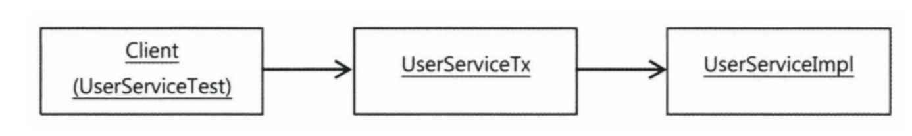

# 6장. AOP


https://www.notion.so/6-AOP-5513dcb93b1c41889398d1ab55ecc88d


스프링의 3대 기반 기술

AOP

DI

IOC

# 6.1 트랜잭션 코드의 분리

## 6.1.1. 메소드의 분리

비즈니스 로직을 담당하는 코드를 메소드로 추출해서 독립시켜보자.

### 6.1.2 DI를 이용한 클래스의 분리

트랜잭션 코드도 밖으로 뺄 수는 없을까?

### DI 적용을 이용한 트랜잭션 분리

DI의 기본 아이디어 : 실제 사용할 오브젝트의 클래스 정체는 감춘 채 인터페이스를 통해 간접으로 접근하는 것이다. 그 덕분에 구현 클래스는 얼마든지 외부에서 변경할 수 있다.

→ service 의 인터페이스

: userService → userServiceImpl

### UserService 인터페이스의 도입

```java
public interface UserService{
     void add(User user);
}
```

```java
public class UserserviceImpl implements UserService{
		UserDao userDao;

		public void add(User user){
	  }
}
```

### 분리된 트랜잭션 기능

근데 또 service에서 트랜잭션이 적용되어야 하는 부분들은 

UserServiceTx implements UserService를 생성해서 만들어주는 것

### 트랜잭션 적용을 위한 DI 설정



의존관계는 위와 같이 구성되어야 한다.

### 트랜잭션 경계설정 코드 분리의 장점

1. 비즈니스로직을 담당하고 있는 UserServiceImpl의 코드를 작성할 때는 트랜잭션과 같은 기술적인 내용에는 전혀 신경 쓰지 않아도 된다. 트랜잭션의 적용이 필요한지도 신경 쓰지 않아도 된다.
2. 스프링의 JDBC 나 JTA 같은 로우레벨의 트랜잭션 API는 물론이고 스프링의 트랜잭션 추상화 API조차 필요 없다. 트랜잭션은 DI를 통해 트랜잭션 기능을 가진 오브젝트가 먼저 실행되도록 만들기만 하면 된다.(ex. UserServiceTx)
3. 비즈니스로직에 대한 테스트도 손쉽게 만들어낼 수 있다.

# 6.2 고립된 단위 테스트

테스트의 단위가 작아야 실패 했을 때 원인을 찾기 쉽다. 

테스트 의도나 내용이 분명해지고, 만들기도 쉬워진다.

## 6.2.1 복잡한 의존 관계 속의 테스트

작은 userService를 테스트하고 싶지만 결국 userServie는 오브젝트, 환경,서비스,서버,네트워크,DB,DB드라이버등 너무 많은 의존관계를 가지고 있다.

## 6.2.2 테스트 대상 오브젝트 고립시키기


dao는 MOCK 오브젝트를 이용해 테스트한다.

이렇게 하면 테스트 수행 성능은 엄청나게 향상 된다.

## 6.2.3 단위테스트와 통합 테스트

단위 테스트: 테스트 대상 클래스를 목 오브젝트 등의 테스트 대역을 이용해 의존 오브젝트나 외부의 리소스를 사용하지 않도록 고립시켜서 테스트 하는 것. 

통합 테스트 : 두개 이상의, 성격이나 계층이 다른 오브젝트가 연동핟록 만들어 테스트 하거나, 또는 외부의 유나 파일, 서비스 등의 리소스가 참여하는 테스트 

## 6.2.4 목 프레임워크

단위테스트를 만들기 위해서는 스텁이나 목 오브젝트의 사용이 필수적이다. 

그러나 이러한 목 오브젝트를 만드는것은 너무나 번거로운 일인데, 이러한 번거로운 일을 지원해주는 프레임워크가 있다.

### Mockito 프레임워크

```java
UserDao mockUserDao = mock(UserDao.class); // 일단 생성 
when(mockUSerDao.getAll()).thenReturn(this.users); //스텁 기능 추가
verify(mockUserDao, times(2)).update(any(User.class));
//update() 메소드가 2번 호출 됐는지 확인 
```

Mockito 목 오브젝트는 다음의 네 단계를 거쳐서 사용하면 된다.

- 인터페이스를 이용해 목 오브젝트를 만든다.
- 목 오브젝트가 리턴할 값이 있으면 이를 지정해준다. 메소드가 호출되면 예외를 강제로 던지게 만들수도 있다.
- 테스트 대상 오브젝트에 DI 해서 목 오브젝트가 테스트 중에 사용되도록 만든다.
- 테스트 대상 오브젝트를 사용한 후에 목 오브젝트의 특정 메소드가 호출됐는지, 어떤 값을 가지고 몇 번 호출됐는지를 검증한다.

# 6.3 다이내믹 프록시와 팩토리 빈

## 6.3.1 프록시와 프록시 패턴, 데코레이션 패턴


부가 기능 외에 나머지 모든 기능은 핵심 기능을 가진 클래스로 위임해줘야 한다. 핵심기능은 부가기능 클래스의 존재 자체를 모른다. 따라서 부가기능이 핵심기능을 사용하는 구조가 되는 것이다.

그래서 클라이언트는 부가기능을 거쳐서 핵심기능을 사용하도록 만들어야 한다. 

프록시 : 이렇게 클라이언트의 요청을 받아주는 대리자, 대리인 같은 역할을 하는 것

타깃 또는 실체 : 프록시를 통해 최종적으로 요청을 위임받아 처리하는 실제 오브젝트

부가기능: 프록시

핵심기능: 타깃

프록시 사용 목적

1. 클라이언트가 타깃에 접근하는 방법을 제어하기 위해서
2. 타깃에 부가적인 기능을 부여해주기 위해서

목적에 따라 디자인패턴에서는 다른 패턴으로 구분한다.

### 데코레이션 패턴

: 타깃에 부가적인 기능을 런타임 시 다이내믹하게 부여해주기 위해 프록시를 사용하는 패턴

코드 상에서는 어떤 방법과 순서로 프록시와 타깃이 연결되어 사용되는지 정해져 있지 않다.

데코레이션 패턴에서는 프록시가 꼭 한 개로 제한되지 않는다.

프록시가 직접 타깃을 사용하도록 고정시킬 필요도 없다. 

데코레이터 패턴은 타깃의 코드를 손대지 않고, 클라이언트가 호출하는 방법도 변경하지 않은 채로 새로운 기능을 추가할 때 유용한 방법이다.

### 프록시 패턴

일반적으로 사용하는 프록시라는 용어와 디자인 패턴에서 말하는 프록시 패턴은 구분하여 사용할 필요가 있다.

- 프록시 : 클라이언트와 사용 대상 사이에 대리 역할을 맡은 오브젝트를 두는 방법을 총칭
- 프록시 패턴 : 프록시를 사용하는 방법 중에서 타깃에 대한 접근 방법을 제어하려는 목적을 가진 경우

## 6.3.2 다이내믹 프록시

프록시는 기존 코드에 영향을 주지 않으면서 타깃의 기능을 확장하거나 접근 방법을 제어할 수 있는 유용한 방법이다.

java.lang.reflect : 패키지 안에 프록시를 손쉽게 만들수 있도록 지원해주는 클래스들

기본적인 아이디어는 목 프레임워크와 비슷하다. 일일이 프록시 클래스를 정의하지 않고도 몇 가지 API를 이용해 프록시처럼 동작하는 오브젝트를 다이내믹하게 생성하는 것이다.

### 프록시 구성과 프록시 작성의 문제점

**프록시의 기능**

- 타깃과 같은 메소드를 구현하고 있다가 메소드가 호출되면 타깃 오브젝트로 위임한다.
- 지정된 요청에 대해서는 부가기능을 수행한다.

**프록시 작성이 번거로운 이유**

- 타깃의 인터페이스를 구현하고 위임하는 코드를 작성하기가 번거롭다는 점이다. 부가기능이 필요 없는 메소드도 구현해서 타깃으로 위임하는 코드를 일일이 만들어줘야 한다.
- 부가기능 코드가 중복될 가능성이 많다.

### 리플렉션

다이내믹 프록시는 리플렉션 기능을 이용해서 프록시를 만들어준다.

리플렉션은 자바의 코드 자체를 추상화 해서 접근하도록 만든 것이다.

### 프록시 클래스

### 다이나믹 프록시 적용


- 다이나믹 프록시는 프록시 팩토리에 의해 런타임 시 다이내믹하게 만들어지는 오브젝트다.
- 다이내믹 프록시 오브젝트는 타깃의 인터페이스와 같은 타입으로만들어진다.
- 클라이언트는 다이내믹 프록시 오브젝트를 타깃 인터페이스를 통해 사용할 수 있다.
- 다이나믹 프록시 덕분에 프록시를 만들 때 인터페이스를 모두 구현해가면서 클래스를 정의하는 수고를 덜 수 있다.
- 프록시 팩토리에게 인터페이스 정보만 제공해주면 해당 인터페이스를 구현한 클래스의 오브젝트를 자동으로 만들어준다.
- 프록시로서 필요한 부가기능 제공 코드는 직접 작성해야 한다. 부가기능은 프록시 오브젝트와 독립적으로 InvocationHandler를 구현한 오브젝트에 담는다.
- InvocationHandler 인터페이스는 아래 메소드 하나만 가진 간단한 인터페이스이다.

```java
public Object invoke(Object proxy, Method method, Object[] args) throws Throwable;
```

invoke( ) 메소드는 리플렉션의 Method 인터페이스를 파라미터로 받는다. 메소드를 호출할 때 전달되는 파라미터도 args로 받는다.

다이내믹 프록시 오브젝트는 클라이언트의 모든 요청을 리플렉션 정보로 변환해서 InvocationHandler 구현 오브젝트의 invoke() 메소드로 넘기는 것이다. 타깃 인터페이스의 모든 메소드 요청이 하나의 메소드로 집중되기 때문에 중복되는 기능을 효과적으로 제공할 수 있다.


Hello 인터페이스를 제공하면서 프록시 팩토리에게 다이내믹 프록시를 만들어달라고 요청하면 Hello 인터페이스의 모든 메소드를 구현한 오브젝트를 생성해준다.

 InvocationHandler 인터페이스를 구현한 오브젝트를 제공해주면 다이나믹 프록시가받는 모든 요청을 InvocationHandler의 invoke() 메소드로 보내준다. Hello 인터페이스의 메소드가 아무리 많더라도 invoke() 메소드 하나로 처리할 수 있다.

```java
public class UppercaseHandler implements InvocationHandler {
    
    private final Hello target;

    public UppercaseHandler(Hello target) {
        this.target = target;
    }

    @Override
    public Object invoke(Object proxy, Method method, Object[] args) throws Throwable {
        Object ret =  method.invoke(target, args);
        if (ret instanceof String) {
            return ((String) ret).toUpperCase();
        }
        return ret;
    }
}
```

모든 요청을 타깃에 위임하면서 리턴값을 대문자로 바꿔주는 부가기능을 가진 InvocationHandler 클래스.

<프록시 생성>

```java
Hello proxiedHello = (Hello) Proxy.newProxyInstance(getClass().getClassLoader(),
                                                    new Class[]{Hello.class},
                                                    new UppercaseHandler(new HelloTarget()));
```

**사용방법**

- 첫 번째 파라미터는 클래스 로더를 제공해야 한다. 다이내믹 프록시가 정의되는 클래스 로더를 지정하는 것이다.
- 두 번째 따라미터는 다이내믹 프록시가 구현해야 할 인터페이스다. 다이내믹 프록시는 한 번에 하나 이상의 인터페이스를 구현할 수도 있다. 따라서 인터페이스의 배열을 사용한다.
- 마지막 파라미터로는 부가기능과 위임 관련 코드를 담고 있는 InvocationHandler 구현 오브젝트를 제공해야 한다.

### 다이내믹 프록시의 확장

InvocationHandler는 단일 메소드에서 모든 요청을 처리하기 때문에 어떤 메소드에 어떤 기능을 적용할지를 선택하는 과정이 필요할 수도 있다.

호출하는 메소드의 이름, 파라미터의 개수와 타입, 리턴 타입 등의 정보를 가지고 부가적인 기능을 적용할 메소드를 선택할 수 있다.

```java
@Override
public Object invoke(Object proxy, Method method, Object[] args) throws Throwable {
    Object ret =  method.invoke(target, args);
    if (ret instanceof String && method.getName().startsWith("say")) {
   // 리턴 타입과 메소드 이름이 일치하는 경우에만 부가기능을 제공한다. 
        return ((String) ret).toUpperCase();
    }
    return ret; //조건이 일치하지 않으면 타깃 오브젝트의 호출 결과를 그대로 리턴한다.
}
```

## 6.3.3 다이내믹 프록시를 이용한 트랜잭션 부가기능

## 6.3.4 다이내믹 프록시를 위한 팩토리 빈

사전에 프록시 오브젝트의 클래스 정보를 미리 알아내서 스프링 빈에 정의할 방법이 없다. 다이내믹 프록시는 proxy 클래스의 newProxyInstance()라는 스태틱 팩토리 메소드를 통해서만 만들 수 있다.

### 팩토리 빈

스프링은 클래스 정보를 가지고 디폴트 생성자를 통해 오브젝트를 만드는 방법외에도 빈을 만들 수 있는 여러가지 방법을 제공한다.

대표적으로 팩토리 빈을 이용한 빈 생성 방법을 들 수 있다.

팩토리 빈 : 스프링을 대신해서 오브젝트의 생성로직을 담당하도록 만들어진 특별한 빈

팩토리 빈을 만드는 방법

1. FactoryBean 이라는 인터페이스를 구현

```java
public interface FactoryBean<T> {
	T getObject() throws Exception; //빈 오브젝트를 생성해서 돌려준다.
	Class<?> getObjectType(); // 생성되는 오브젝트의 타입을 알려준다.
	boolean isSingleton(); //getObject()가 돌려주는 오브젝트가 항상 같은 싱글톤 오브젝트인지 알려준다.
}
```

팩토리 빈은 전형적인 팩토리 메소드를 가진 오브젝트다. 스프링은 FactoryBean 인터페이스를 구현한 클래스가 빈의 클래스로 지정되면, 팩토리 빈 클래스의 오브젝트의 getObject()를 이용해 오브젝트를 가져오고, 이를 빈 오브젝트로 사용한다. 빈의 클래스로 등록된 팩토리 빈은 빈 오브젝트를 생성하는 과정에만 사용될 뿐이다.

### 팩토리빈의 설정 방법

드물지만 팩토리빈이 만들어주는 빈 오브젝트가 아닌 팩토리 빈 자체를 가져오고 싶은 경우도 있다.

이럴 때를 위해 스프링은 '&' 를 빈 이름 앞에 붙혀주면 팩토리 빈 자체를 돌려준다.

```java
Object factory = context.getBean("&message");
```

### 다이내믹 프록시를 만들어주는 팩토리 빈

팩토리 빈을 사용하면 다이내믹 프록시 오브젝트를 스프링의 빈으로 만들어줄 수가 있다.

팩토리 빈의 getObject() 메소드에 다이내믹 프록시 오브젝트를 만들어주는 코드를 넣으면 되기 때문이다.


## 6.3.5 프록시 팩토리 빈 방식의 장점과 한계

### 프록시 팩토리 빈의 재사용

- 하나 이상의 팩토리 빈을 동시에 여러개 등록해도 상관없다. 팩토리 빈이기 때문에 각 빈의 타입은 타깃 인터페이스와 일치한다.
- 프록시 팩토리 빈을 이용하면 프록시 기법을 아주 빠르고 효과적으로 적용할 수 있다.

### 프록시 팩토리 빈 방식의 장점

- 다이내믹 프록시를 이용하면 타깃 인터페이스를 구현하는 클래스를 일일이 만드는 번거로움을 제거할 수 있다.
- 하나의 핸들러 메소드를 구현하는 것만으로도 수많은 메소드에 부가기능을 부여 해줄 수 있으니 부가기능 코드의 중복 문제도 사라진다.

### 프록시 팩토리 빈의 한계

- 프록시를 통해 타깃에 부가기능을 제공하는 것은 메소드 단위로 일어나는 일이다. 하나의 클래스 안에 존재하는 여러개의 메소드에 부가기능을 한 번에 제공하는 건 어렵지 않게 가능했다. 하지만 한 번에 여러 개의 클래스에 공통적인 부가기능을 제공하는 일은 지금까지 살펴본 방법으로는 불가능하다.
- 하나의 타깃 오브젝트에만 부여되는 부가기능이라면 상관없겠지만, 트랜잭션과 같이 비즈니스 로직을 담은 많은 클래스의 메소드에 적용할 필요가 있다면 거의 비슷한 프록시 팩토리 빈의 설정이 중복되는 것을 막을 수 없다.

# 6.4 스프링의 프록시 팩토리 빈

## 6.4.1 ProxyFactoryBean

ProxyFactoryBean은 프록시를 생성해서 빈 오브젝트로 등록하게 해주는 팩토리 빈이다.

ProxyFactoryBean은 순수하게 프록시를 생성하는 작업만을 담당하고 프록시를 통해 제공해줄 부가기능은 별도의 빈에 둘수 있다.

### 어드바이스: 타깃이 필요 없는 순수한 부가기능

ProxyFactoryBean에 이 Methodlnterceptor를 설정해줄 때는 일반적인 DI 경우 처럼 수정자 메소드를 사용하는 대신 addAdvice() 메소드를 사용한다.

ProxyFactoryBean에는 여러 개의 Methodlnterceptor를 추가할 수 있다. ProxyFactoryBean 하나만으로 여러 개의 부가 기능을 제공해주는 프록시를 만들 수 있다는 뜻이다.

Methodlnterceptor는 Advice 인터페이스를 상속하고 있는 서브인터페이스이다.

Methodlnterceptor처럼 타깃 오브젝트에 적용하는 부가 기능을 담은 오브젝트를 스프링에서는 어드바이스(advice)라고 부른다.

ProxyFactoryBean은 인터페이스 타입을 굳이 제공받지않아인터페이스 자동검출 기능을 사용해 타깃 오브젝트가 구현하고 있는 인터페이스 정보를 알아낸다. 그리고 알아낸 인터페이스를 모두 구현하는 프록시를 만들어준다.

### 포인트 컷 : 부가기능 적용 대상 메소드 선정 방법

스프링의 ProxyFactoryBean 방식은 두 가지 확장 기능인 부가기능(Advice)과 메소드 선정 알고리즘(PointCut)을 활용하는 유연한 구조를 제공한다.


- 어드바이스 : 부가기능을 제공하는 오브젝트
- 포인트 컷 : 메소드 선정 알고리즘을 담은 오브젝트

## 6.4.2 ProxyFactoryBean 적용

### transactionAdvice

### 어드바이스와 포인트컷 재사용

ProxyFactoryBean은 스프링의 DI와 템플릿/콜백패턴, 서비스 추상화 등의 기법이 모두 적용됐다. 그 덕분에 독립적이며, 공유할 수 있게 확장 기능을 분리할 수 있었다.


# 6.5 스프링 AOP

## 6.5.1 자동 프록시 생성

남은 문제 : 부가기능의 적용이 필요한 타깃 오브젝트마다 거의 비슷한 내용의 

ProxyFactoryBean 빈 설정정보를 추가해주는 부분

### 중복 문제의 접근 방법

- JDBC API를 사용하는 DAO 코드 : 템플릿 콜백, 클라이언트로 나누는 방법을 통해 해결 → 전략패턴과 DI 적용
- 반복적인 위임 코드가 필요한 프록시 클래스 코드 : 단순한 분리와 DI와는 다른 독특한 방법으로 해결 → 다이내믹 프록시라는 런타임 코드 자동생성 기법을 이용 : 변하지 않는 타깃으로의 위임과 부가기능 적용 여부 판단이라는 부분은 코드 생성 기법을 이용하는 다이내믹 프록시 기술에 맡기고, 변하는 부가기능 코드는 별도로 만들어 다이내믹 프록시 생성 팩토리에 DI로 제공하는 방법을 사용. 즉, 변하는 로직과 변하지않는 로직을 분리

### 빈 후처리기를 이용한 자동 프록시 생성기

BeanPostProcessor 인터페이스를 구현해서 만드는 빈 후처리기.

빈 후처리기 : 스프링 빈 오브젝트로 만들어지고 난 후에, 빈 오브젝트를 다시 가공할 수 있게 해준다. 

DefaultAdvisorAutoProxyCreator : 스프링이 제공하는 빈 후처리기 중 하나

스프링은 빈 후처리기가 빈으로 등록되어 있으면 빈 오브젝트가 생성될 때마다 빈 후처리기에 보내서 후처리 작업을 요청한다.

빈 후처리기는 빈 오브젝트의 프로퍼티를 강제로 수정할 수도 있고, 별도의 초기화 작업을 진행할 수도 있다. 심지어는 만들어진 빈 오브젝트가 아닌 다른 오브젝트를 빈으로 등록시키는 것이 가능하다. (바꿔치기)

이를 잘 이용하면 스프링이 생성하는 빈 오브젝트의 일부를 프록시로 포장하고, 프록시를 빈으로 대신 등록할 수도 있다. 바로 이것이 자동 프록시 생성 빈 후처리기다. 

## 6.5.2 DefaultAdvisorAutoProxyCreator의 적용

## 6.5.3 포인트컷 표현식을 이용한 포인트컷

단순한 이름을 비교하는 일이 아닌, 이보다 더 복잡하고 세밀한 기준을 이용해 클래스나 메소드를 선정하게 하려면 어떻게 해야 할까?

### 포인트컷 표현식

포인트컷 표현식을 지원하는 포인트컷을 적용하려면 AspectExpressionPointcut 클래스를, 즉 AspectJ 포인트컷 표현식을 사용한다.

### 포인트컷 표현식 문법


execution() 지시자를 사용한 포인트컷 표현식의 문법구조는 기본적으로 아래와 같다. execution 지시자는 메소드의 풀 시그니처를 문자열로 비교하는 개념이라고 생각하면 간단하다.

- execution([접근제한자 패턴] 타입패턴 [타입패턴.]이름패턴 (타입패턴 | “..”, …) [throws 예외 패턴])
- [] 괄호는 옵션항목이기 때문에 생략이 가능하다.
- |는 OR 조건이다.
- 접근제한자 패턴 : 생략 가능하다.
- 타입 패턴 : 리턴 값의 타입을 나타내는 패턴이다. 포인트컷의 표현식에서 리턴 값의 타입 패턴은 필수항목이다. 따라서 반드시 하나의 타입을 지정해야 한다. *를 써서 모든 타입을 다 선택하겠다고 해도 된다.
- [타입패턴.] : 패키지와 타입 이름을 포함한 클래스의 타입 패턴이다. 역시 생략 가능하다. 생략하면 모든 타입을 다 허용하겠다는 뜻이다. 뒤에 이어나오는 메소드 이름 패턴과 . 으로 연결되기 때문에 작성할 때 잘 구분해야 한다. ‘..’를 사용하면 한번에 여러 개의 패키지를 선택할 수있다.
- 이름 패턴 : 메소드 이름 패턴이다. 필수항목이기 때문에 반드시 적어야 한다. 모든 메소드를 다 선택하겠다면 *를 넣으면 된다.
- (타입패턴 | “..”, …) : 메소드 파라미터의 타입 패턴이다. 메소드 파라미터의 타입을 ,로 구분하면서 순서대로 적으면 된다. 파라미터가 없는 메소드를 지정하고 싶다면 ()로 적는다. 파라미터의 타입과 개수에 상관없이 모두 다 허용하는 패턴으로 만들려면 “..”을 넣으면 된다. “…“을 이용해서 뒷부분의 파라미터 조건만 생략할 수도 있다.
- [throws 예외 패턴] : 예외 이름에 대한 타입 패턴이다. 생략 가능하다.


### 타입 패턴과 클래스 이름 패턴

단순한 클래스 이름 패턴과 포인트컷 표현식에서 사용하는 타입패턴은 중요한 차이점이 있다.

타입 패턴은, 슈퍼 클래스의 타입..으로 한다! 단순 이름이 아니다..!

## 6.5.4 AOP란 무엇인가?

- 트랜잭션 서비스 추상화
- 프록시와 테코레이션 패턴
- 다이내믹 프록시와 프록시 팩토리 빈
- 자동 프록시 생성 방법과 포인트 컷
- 부가기능 모듈화

### AOP : 애스펙트 지향 프로그래밍

- 애스팩트(aspect) : 애스펙트란 그 자체로 애플리케이션의 핵심기능을 담고 있지는 않지만, 애플리케이션을 구성하는 중요한 한 가지 요소이고, 핵심 기능에 부가되어 의미를 갖는 특별한 모듈을 가리킨다.

- 이렇게 애플리케이션의 핵심적인 기능에서 부가적인 기능을 분리해서 애스펙트라는 독특한 모듈로 만들어서 설계하고 개발하는 방법을 애스펙트 지향 프로그래밍(Aspect Oriented Programming) 또는 약자로 AOP라고 부른다.

- AOP는 OOP를 돕는 보조적인 기술이지 OOP를 완전히 대체하는 새로운 개념이 아니다.

- AOP는 애스펙트를 분리함으로써 핵심기능을 설계하고 구현할 때 객체지향적인 가치를 지킬 수 있도록 도와주는 것

- AOP는 결국 애플리케이션을 다양한 측면에서 독립적으로 모델링하고, 설계하고, 개발할 수 있도록 만들어주는 것이다.

- 애플리케이션을 특정한 관점을 기준으로 바라볼 수 있게 해준다는 의미에서 AOP를 관점지향프로그래밍 이라고도 한다.

## 6.5.5 AOP 적용 기술

### 프록시를 이용한 AOP : AOP의 핵심

## 6.5.6 AOP의 용어

- 타깃 : 타깃은 부가기능을 부여할 대상, 핵심기능을 담은 클래스일 수도 있지만 경우에 따라서는 다른 부가기능을 제공하는 프록시 오브젝트일 수도 있다.
- 어드바이스 : 어드바이스는 타깃에게 제공할 부가기능을 담은 모듈
- 조인포인트 : 어드바이스가 적용될 수 있는 위치, 타깃 오브젝트가 구현한 인터페이스의 모든 메소드는 조인 포인트가 된다.
- 포인트컷 : 어드바이스를 적용할 조인포인트를 선별하는 작업 또는 그 기능을 정의한 모듈
- 프록시: 클라이언트와 타깃의 사이에 투명하게 존재하면서 부가기능을 제공하는 오브젝트, 스프링은 프록시를 이용해 AOP를 지원한다.
- 어드바이저: 포인트컷과 어드바이스를 하나씩 갖고 있는 오브젝트. 어드바이저는 어떤 부가기능(어드바이스)을 어디에(포인트컷) 전달할 것인가를 알고있는 AOP의 가장 기본이 되는 모듈이다. 어드바이저는 스프링 AOP에서만 사용되는 특별한 용어이다. (다른 AOP에서는 사용하지 않는다.)
- 애스펙트 : OOP의 클래스와 마찬가지로 애스펙트는 AOP의 기본 모듈이다.

## 6.5.7 AOP 네임스페이스

스프링의 프록시 방식 AOP를 적용하려면 최소한 네 가지 빈을 등록해야 한다.

- 자동 프록시 생성기
- 어드바이스
- 포인트컷
- 어드바이저

# 6.6 트랜잭션 속성

## 6.6.1 트랜잭션 정의

트랜잭션의 기본 개념인 더 이상 쪼갤 수 없는 최소의 단위라는 작업의 개념은 항상 유효하면서도, 커밋과 롤백외에  트랙잭션의 동작방식을 제어할 수 있는 몇가지 다른 조건이 있다.

DefaultTransactionDefinition이 구현하고 있는 TransactionDefinition 인터페이스는 트랜잭션의 동작방식에 영향을 줄 수 있는 네 가지 속성을 정의한다.

### 트랜잭션 전파

트랜잭션 전파(transaction propagation)이란,

트랜잭션의 경계에서 이미 진행 중인 트랜잭션이 있을 때 또는 없을 때 어떻게 동작할 것인가를 결정하는 방식을 말한다.

- PROPAGATION_REQUIRED : 가장 많이 사용되는 트랜잭션 전파 속성

진행 중인 트랜잭션이 없으면 새로 시작하고, 이미 시작된 트랜잭션이 있으면 이에 참여한다. default 속성이다.

- PROPAGATION_REQUIRES_NEW : 항상 새로운 트랜잭션을 시작한다
- PROPAGATION_NOT_SUPPORTED : 진행중인 트랜잭션이 있어도 무시한다.

### 격리수준

모든 DB 트랜잭션은 격리수준(isolation level)을 갖고 있어야 한다.

기본은 isolation_dafault 이다. 이는 datasource에 설정된 디폴트 격리수준을 그대로 따른 다는 것이다.

### 제한시간

트랜잭션을 수행하는 제한시간을 설정할 수 있다. 기본은 제한시간이 없는 것이다.

### 읽기전용

readOnly로 해두면 트랜잭션 내에서 데이터를 조작하는 시도를 막아줄 수 있다. 

# 6.7 애노테이션 트랜잭션 속성과 포인트 컷

## 6.7.1 트랜잭션 애노테이션

### @Transactional

@Transactional 애노테이션의 타깃은 메소드와 타입이다. 따라서, 메소드, 클래스, 인터페이스에 사용할 수 있다.


### 대체 정책

@Transactional은 4단계의 대체정책(fallback)을 이용하게 해준다.

메소드의 속성을 확인할 때, 타깃 메소드, 타깃 클래스, 선언 메소드, 선언 타입(클래스,인터페이스)의 순서에 따라서 @Transactional이 적용됐는지 차례로 확인하고 가장 먼저 발견되는 속성 정보를 사용하게 하는 방법이다.


트랜잭션이 위치할 수 있는 6개의 후보

# 6.8 트랜잭션 지원 테스트

### @TransactionConfiguration

@Transactional은 테스트 클래스에 넣어서 모든 테스트 메도스에 일괄 적용할 수 있지만 @Rollback 애노테이션은 메소드 레벨에만 적용할 수 있다.

@TransactionalConfiguration은 모든 메소드에 트랜잭션을 적용하면서 모든 트랜잭션이 롤백되지 않고 커밋되게 할 수 있다.

→ 클래스 레벨에 부여할 수 있다.

→ 롤백에 대한 공통 속성을 지정할 수 있다.