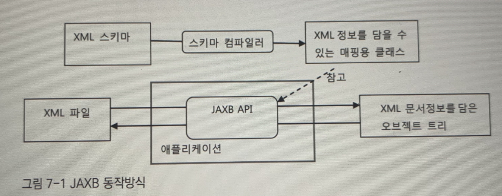

# 7장. 스프링 핵심 기술의 응용


https://www.notion.so/7-64ea7de7de4941e3b44f4e9d4f013a45

# 7.1 SQL과 DAO의 분리

DB테이블과 필드정보를 고스란히 담고 있는 SQL 문장들의 분리

## 7.1.1 XML 설정을 이용한 분리

### 개별 SQL 프로퍼티 방식

xml로 sql를 만들어서, xml을 이용하는 방식 

### SQL 맵 프로퍼티 방식

userDao에서 SQL을 주입받기 위해 개별적으로 정의한 프로퍼티를 모두 제거하고, Map타입의 sqlMap프로퍼티를 대신 추가한다.

map에서는 xml을 이용

```xml
<bean id="userDao" class="springbook.user.dao.UserDaoJdbc">
  <property name="dataSource" ref="dataSource" />
    <property name="sqlMap">
      <map>
        <entry key="get" value=" select * from users order by id" />
        .
        .
        .
      </map>
    </property>
</bean>
```

새로운 sql문이 필요하면 <entry>만 추가하면 된다.

## 7.1.2 SQL 제공 서비스

### SQL 서비스 인터페이스

```java
public interface SqlService {
    String getSql(String key) throws SqlRetrievalFailureException;
}
```

어떤 이유에서는 sql을 가져오다가 실패하는 경우에는 SqlRetrievalFailureException 예외를 던지도록 정의한다.

```java
public class SqlRetrievalFailureException extends RuntimeException {
    public SqlRetrievalFailureException() {
    }

    public SqlRetrievalFailureException(String message) {
        super(message);
    }

    public SqlRetrievalFailureException(String message, Throwable cause) {
        super(message, cause);
    }
}
```

### 스프링 설정을 사용하는 단순 SQL 서비스

어떤 방법을 사용하든 상관없이 DAO가 요구하는 SQL을 돌려주기만 하면된다.

맵에서 sql을 읽어서 돌려주도록 sqlService의 getSql() 메소드를 구현해보자.

```java
public class SimpleSqlService implements SqlService {

    private final Map<String, String> sqlMap;

    public SimpleSqlService(Map<String, String> sqlMap) {
        this.sqlMap = sqlMap;
    }

    @Override
    public String getSql(String key) throws SqlRetrievalFailureException {
        String sql = sqlMap.get(key);
        if (sql == null) {
            throw new SqlRetrievalFailureException(key + "에 대한 SQL을 찾을수 없습니다");
        }
        return sql;
    }
}
```

그리고 sql 정보는 맵을 이용해 등록하여 사용한다.

# 7.2 인터페이스 분리와 자기 참조 빈

## 7.2.1 XML 파일 매핑

검색용 키와 SQL 문장 두 가지를 담을 수 있는 간단한 XML 문서를 설계해보고, 이 XML 파일에서 SQL을 읽어뒀다가 DAO에게 제공해주는 SQL 서비스 구현 클래스를 만들어보자.

### JAXB

XML에 담긴 정보를 파일에서 읽어오는 방법으로 JAXB(Java Architecture for XML Binding를 이욯가ㅔㅆ다.

JDK 6 라면 java.xml.bind 패키지 안에서 JAXB의 구현 클래스를 찾을 수 있다. 

JAXB의 장점은 XML 문서 정보를 거의 동일한 구조의 오브젝트로 직접 매핑해준다는 것이다.

전통적인 XML API인 DOM과 비교했을 때, DOM은 XML 정보를 마치 자바의 리플렉션 API를 사용해서 오브젝트를 조작하는 것처럼 간접적으로 접근해야 하는 불편이 있지만,

그에 비해 JAXB는 XML의 정보를 그대로 담고 있는 오브젝트 트리 구조를 만들어주기 때문에 XML 정보를 오브젝트처럼 다룰 수 있어 편리하다.

JAXB는 XML 문서의 구조를 정의한 스키마를 이용해서 매핑할 오브젝트의 클래스까지 자동으로 만들어주는 컴파일러도 제공해준다. 스키마 컴파일러를 통해 자동생성된 오브젝트에는 매핑정보가 어노테이션으로 담겨 있다.

JAXB API는 어노테이션에 담긴 정보를 이용해서 XML과 매핑된 오브젝트 트리 사이의 자동변환 작업을 수행해준다.

)

### SQL 맵을 위한 스키마 작성과 컴파일

```xml
<sqlmap>
   <sql key="userAdd"> insert into users(...) ... </sql>
   <sql key="userGet"> select * from users ... </sql>
</sqlmap>
```

```xml
<element name="sqlmap">
   <complexType>
      <sequence>
         <element name="sql" maxOccurs="unbounded" type="tns:sqlType" />
      </sequence>
   </complexType>
</element>
```

<sql> 태그를 가진 XML 문서와 XML 문서 구조를 정의하고 있는 XML 스키마.

sqlService를 정의한 패키지 아래에 jaxb패키지를 추가한 뒤에 이를 사용하자.

셸이나 도스창에서 프로젝트 루트 폴더로 이동한 뒤에 다음 명령을 사용해 컴파일하면 된다.

### 언마샬링

언마샬링 : xml문서를 읽어서 자바의 오브젝트로 변환하는 것

마샬링 : 바인딩 오브젝트를 XML 문서로 변환하는 것

직렬화 : 자바오브젝틀 바이트 스트림으로 바꾸는 것

## 7.2.2 XML 파일을 이용하는 SQL 서비스

### SQL맵 XML 파일

dao가 xml을 요청할 때마다 매번 XML 파일을 다시 읽어서 SQL을 찾는건 너무 비효율 적인 방법이다. XML파일로부터 읽은 내용은 어딘가에 저장해두고 DAO에서 요청이 올 때 까지 사용해야 한다. 

검색속도가 빠르고 사용하기 간편한 Map 타입 오브젝트에 저장해두는 게 더 나은 방법일 것 같다.

## 7.2.3 빈의 초기화 작업

@PostConstruct : java.lang.annotaion 패키지에 포함된 공통 어노테이션의 한가지로,

초기화 작업을 수행할 메소드에 부여해주면 스프링은 xmlSqlService 클래스로 등록된 빈의 오브젝트를 생성하고 DI작업을 마친 뒤에 @PostContruct가 붙은 메소드를 자동으로 실행해준다.

모든 준비된 후에 실행된다는 면에서 @PostContruct 초기화 메소드는 매우 유용하다.


sqlService 의 빈 설정 값들이 초기화된 후 자동으로 loadSql()이 실행된다.

@PostContruct ****어노테이션은 빈 오브젝트가 생성되고 의존 오브젝트와 설정 값을 넣어주는 DI 작업까지 마친 후에 호출된다.

@PostContruct를 단 메소드의 코드는 모든 프로퍼티의 값이 준비됐다고 가정하고 작성하면 된다.

)

## 7.2.4 변화를 위한 준비 : 인터페이스 분리

## 7.2.5 자기참조 빈으로 시작하기

자바는 extends를 이용해 다른 클래스의 구현 내용을 상속하려는 경우네는 하나의 클래스만 상속하게 제한한다. 하지만 인터페이스의 경우는 다르다. 인터페이스는 한개 이상을 상속하는 것을 허용한다.

인터페이스 구현은 타입을 상속하는 것이다. 그 덕분에 같은 타입으로 존재하지만 다른 구현을 가진 오브젝트를 만들 수 있다는 다형성을 활용할 수 있는 것이다.

)


getSql()은 내부전략인 SqlResistry 타입 오브젝트에게 요청에 SQL을 가져오게 하고, SqlRegistry 에서 발생하는 예외를 SqlService 인터페이스에서 정의한 예외로 전환해주는 기능을 구현하면 된다.

### 자기 참고 빈 설정

XmlSqlService 클래스 안에 혼재되어 있던 성격이 다른 코드를 세 가지 인터페이스를 구현하는 방법을 통해 서로 깔끔하게 분리해냈다. 

자기 자신을 참조하는 빈은 사실 흔히 쓰이는 방법은 아니다. 책임이 다르다면 클래스를 구분하고 각기 다른 오브젝트로 만들어지는 것이 자연스럽다. 다만, 자기 자기참조 빈을 만들어보는 것은, 책임과 관심사가 복잡하게 얽혀 있어서 확장이 힘들고 변경에 취약한 구조의 클래스를 유연한 구조로 만들려고 할 때 처음 시도해볼 수 있는 방법이다. 이를 통해 기존의 복잡하게 얽혀 있던 코드를 책임을 가진 단위로 구분해낼 수 있다. 당장 확장 구조를 이용해 구현을 바꿔 사용하지 않더라도 확장 구조를 만들어두는 게 좋다고 생각될 때 가장 간단히 접근할 수 있는 방법 이기도 하다.

# 7.3 서비스 추상화 적용

## 7.3.1 OXM 서비스 추상화

JAXB 외에도 실전에서 자주 사용되는 **XML과 자바 오브젝트 매핑 기술**이 있다.

대표적으로 다음 네가지가 있다.

- Castor XML : 설정 파일이 필요 없는 인트로스펙션 모드를 지원하기도 하는 매우 간결하고 가벼운 바인딩 프레임워크다.
- JiBX : 뛰어난 퍼포먼스를 자랑하는 XML 바인딩 기술이다.
- XmlBeans : 아파치 XML 프로젝트의 하나다. XML의 정보셋을 효과적으로 제공해준다.
- Xstream : 관례를 이용해서 설정이 없는 바인딩을 지원하는 XML 바인딩 기술의 하나다.

이렇게 XML과 자바오브젝트를 매핑해서 상호 변환해주는 기술을 간단히 OXM 이라고 한다.

OXM프레임워크와 기술들은 기능면에서 상호 호환성이 있다. JAXB를 포함해서 다섯 가지 기술 모두 사용 목적이 동일하기 때문에 유사한 기능과 API를 제공한다.

스프링이 제공하는 OXM 추상 계층의 API를 이용해 XML 문서와 오브젝트 사이의 변환을 처리하게 하면, 코드 수정 없이도 OXM기술을 자유롭게 바꿔서 적용할 수 있다. 추상 인터페이스를 제공하기 때문에 테스트를 작성하기도 편리하다.

### OXM 서비스 인터페이스

스프링이 제공하는 OXM  추상화 서비스 인터페이스에는 자바 오브젝트를 XML로 변환하는 Marshaller와, 반대로 XML을 자바오브젝트로 변환하는 unmarshaller가 있다.


## 7.3.3 리소스 추상화

URL을 이용해 웹상 리소스를 접근할 수 있게 해주는 클래스 : java.net.URL

이 URL 클래스는 http,ftp,file과 같은 접두어(prefix)를 지정할 수 있어서 다양한 원격 리소스에 접근이 가능하다는 장점이 있지만,

자바 클래스패스 안에 존재하는 리소스나 서블릿 컨텍스트의 리소스 또는 임의의 스트림으로 가져올 수 있는 리소스를 지정하는 방법이 없다는 점과 리소스 파일의존재 여부를 미리 확인할 수 있는 기능이 없다는 단점이 있다.

### 리소스 로더

그래서 스프링에는 URL클래스와 유사하게 접두어를 이용해 Resource 오브젝트를 선언하는 방법이 있다.

문자열로 정의된 리소스를 실제 Resource 타입 오브젝트로 변환 해주는 ResourceLoader를 제공한다.

ResourceLoader의 대표적인 예는 바로 스프링의 어플리케이션 컨텍스트다.

애플리케이션 컨텍스트가 구현해야 하는 인터페이스인 ApplicationContext는 ResourceLoader 인터페이스를 상속하고 있다. 따라서 모든 애플리케이션 컨텍스트는 리소스 로더이기도 하다.

# 7.4 인터페이스 상속을 통한 안전한 기능 확장

## 7.4.1 DI와 기능의 확장

### DI를 의식하는 설계

내부 기능을 적절한 책임과 역할에 따라 분리하고 인터페이스를 느슨하게 연결해주고, DI를 통해 유연하게 의존관계를 지정하도록 설계해둬야 그 뒤 작업이 수월해진다.

→ DI를 의식하면서 설계해라!!

### DI와 인터페이스 프로그래밍

DI는 적용할 때는 가능한 한 인터페이스를 사용하게 해야 한다.

인터페이스를 사용하는 첫 번째 이유는 다형성을 얻기 위해서다. 의존 오브젝트가 가진 핵심 로직을 바꿔적용하는 것, 프록시, 데코레이터, 어댑터, 테스트 대역 등의 다양한 목적을 위해 인터페이스를 통한 다형성이 활용된다.

두번째 이유는 분리 원칙을 통해 클라이언트와 의존 오브젝트 사이의 관계를 명확하게 해줄 수 있기 때문이다.

오브젝트가 그 자체로 충분히 응집도가 높은 작은 단위로 설계됐더라도, 목적과 관심이 각기 다른 클라이언트가 있다면 인터페이스를 통해 이를 적절하게 분리해줄 필요가 있고, 이를 객체지향 설계 원칙에서는 

인터페이스 분리 원칙 이라고 부른다.

## 7.4.2 인터페이스 상속

하나의 오브젝트가 구현하는 인터페이스를 여러 개 만들어서 구분하는 이유 중의 하나는 오브젝트의 기능이 발전하는 과정에서 다른 종류의 클라이언트가 등장하기 때문이다.

인터페이스 분리 원칙이 주는 장점은 모든 클라이언트가 자신의 관심에 따른 접근 방식을 불필요한 간섭 없이 유지할 수 있다는 점이다.

인터페이스를 사용해 DI 관계를 만들었기 때문에 얻을 수 있는 또 다른 장점은 SqlRegistry 구현 클래스인 MySqlRegistry의 오브젝트가 또 다른 제 3의 클라이언트를 위한 인터페이스를 가질 수 있다는 점이다.

# 7.5 DI를 이용해 다양한 구현 방법 적용하기

## 7.5.1 ConcurrentHashMap을 이용한 수정 가능 SQL 레파지토리

면접 단골 질문

HashMap : 멀티스레드 환경에서 동시에 수정을 시도하거나 수정과 동시에 요청하는 경우 예상치 못한 결과가 발생할 수 있다. 멀티스레드 환경에서 안전하게 HashMap을 조작하려면 Collection.synchronizedMap()등을 이용해 외부에서 동기화 해줘야 한다. 그래서 요청이 많은 고성능 서비에서는 성능 문제가 생긴다.

ConcurrentHashMap : 동기화된 해시 데이터 조작에 최적화되도록 만들어져서 일반적으로 권장된다. ConcurrentHashMap은 데이터 조작 시 전체 데이터에 대한 락을 걸지 않고 조회는 락을 아예 사용하지 않는다. 그래서 어느정도 안전하면서 성능이 보장된 동기화된 HashMap으로 이용하기에 적당하다. 

## 7.5.2 내장형 데이터베이스를 이용한 SQL 레지스트리 만들기

ConcurrentHashMap 이 멀티스레드 환경에서 최소한의 동시성을 보장해주고 성능도 그리 나쁜편은 아니지만, 저장되는 데이터의 양이 많아지고 잦은 조회와 변경이 일어나는 환경이라면 한계가 있다.

그래서 내장형 DB를 이용해보자.

내장형 DB는 애플리케이션에 내장돼서 애플리케이션과 함께 시작되고 종료되는 DB를 말한다.

데이터는 메모리에 저장되기 때문에 IO로 인해 발생하는 부하가 적어서 성능이 뛰어나다. 동시에 Map 같은 컬렉션이나 오브젝트를 이용해 메모리에 데이터를 저장해두는 방법에 비해 매우 효과적이고 안정적인 방법으로 등록, 수정, 검색이 가능하다. 최적화된 락킹, 격리수준, 트랜잭션을 적용할 수도 있다.

### 스프링의 내장형 DB 지원 기능

자바에서 많이 사용되는 내장형 데이터 베이스는 Derby,HSQL,H2를 꼽을 수 있다.

모두 JDBC 드라이버를 제공하고 표준 DB와 호환되는 기능을 제공하기 때문에 JDBC프로그래밍 모델을 그대로 따라서 사용할 수 있다.

## 7.5.3 트랜잭션 적용

여러개의 SQL 수정하는 작업은 반드시 트랜잭션 안에서 일어나야 한다.

기본적으로 HashMap과 같은 컬렉션은 트랜잭션 개념을 적용하기가 매우 힘들다. 엘리먼트 하나를 수정하는 정도는 간단한 락킹을 이용해 안정성을 보장해줄 수 있다고 해도, 여러개의 엘리먼트를 트랜잭션과 같은 원자성이 보장된 상태에서 변경하려면 매우 복잡한 과정이 필요하기 때문이다.

반면에 내장형DB를 사용하는 경우에는 트랜잭션 적용이 상대적으로 쉽다. DB 자체가 기본적으로 트랜잭션 기반의 작업에 충실하게 설계됐기 때문이다.

# 7.6 스프링 3.1의 DI

### 자바언어의 변화와 스프링

- 어노테이션의 메타정보 활용

: 자바는 소스코드가 컴파일 된 후 클래스 파일에 저장됐다가, JVM에 의하 메모리로 로딩되어 실행된다. 그런데 때로는 자바 코드가 실행되는 것이 목적이 아니라 다른 자바 코드에 의해 데이터 처럼 취급되기도 한다.

언제부턴가 본래 목적보다는 자바 코드의 메타정보를 데이터로 활용하는 스타일의 프로그래밍 방식에 더 많이 활용되고 있다. 

이런 프로그래밍의 방식의 절정이 자바 5에서 등장한 어노테이션이다.

> 리플렉션 API는 구체적은 클래스 타입을 알지 못해도, 그 클래스의 메소드, 타입, 변수들을 접근할 수 있도록 해주는 JAVA API로  클래스 이름만 알고 있다면 언제든지 메모리 영역에 뒤져서 해당 클래스의 정보를 가져올 수 있습니다.

리플렉션 API를 이용해 어노테이션의 메타정보를 조회하고, 어노테이션 내에 설정된 값을 가져와 참고하는 방법이 전부지만,

이렇게 어느테이션의 활용이 늘어난 이유는 무엇일까?

어노테이션은 애플리케이션을 핵심 로직을 담은 자바 코드와 이를 지원하는 IOC방식의 프레임워크, 그리고 프레임워크가 참조하는 메타정보라는 세 가지로 구성하는 방식에 잘 어울리기 때문일 것이다. 어노테이션은 프레임워크가 참조하는 메타정보로 사용되기에 여러가지 유리한 점이 많다.

스프링 3.1에서는 어노테이션을 이용한 메타정보 작성 방식이 거의 모든 영역으로 확대돼서, 원한다면 스프링 애플리케이션을 XML없이도 작성할 수 잇게 됐다.

- 정책과 관례를 이용한 프로그래밍

스프링은 점차 어노테이션으로 메타정보를 작성하고, 미리 정해진 정책과 관례를 활용해서 간결한 코드에 많은 내용을 담을 수 있는 방식을 적극 도입하고 있다.

## 7.6.1 자바 코드를 이용한 빈 설정

### 텍스트 컨텍스트의 변경

XML에 담겨 있는 정보들을 자바 코드로 바꿔보자.

@ContextConfiguration은 DI 정보를 어디서 가져와야 하는 지 지정할 때 사용하는 어노테이션인데,

클래스 정보를 넣어주면 @Configuration 어노테이션을 찾는다.

<bean> → @Bean이 붙은 퍼블릭 메소드로 만들어준다.

<property> → @Autowired가 붙은 필드를 선언해서 빈을 컨테이너가 주입하게 해준다.

@Resource 는 @Autowired 와 유사하게 필드에 빈을 주입받을 때 사용한다. 차이점은 @Autowired 는 필드 타입을 기준으로 빈을 찾고 @Resource 는 필드 이름을 기준으로 한다는 점이다.

<tx:annotation-driven /> →@EnableTransactionManagement

## 7.6.2 빈 스캐닝과 자동와이어링

### @Autowired 를 이용한 자동 와이어링

스프링은 @Autowired가 붙은 수정자 메소드가 있다면 파라미터 타입을 보고 주입 가능한 타입의 빈을 모두 찾는다.

### @Component를 이용한 자동 빈 등록

@Component는 클래스에 부여된다. @Component가 붙은 클래스는 빈 스캐너를 통해 자동으로 빈으로 등록된다. 정확히는 @Component 또는 @Component를 메타 어노테이션으로 갖고 있는 어노테이션이 붙은 클래스가 자동 빈 등록 대상이 된다.

@Component는 빈으로 등록될 후보 클래스에 붙혀주는 일종의 마커라고 보면 된다.

@ComponentScan : @Component 어노테이션이 달린 클래스를 자동으로 찾아서 빈을 등록해주게 빈 스캔 기능을 사용하겠다는 의미.  @Component 가 붙은 클래스가 발견되면 새로운 빈을 자동으로 추가한다.

@Repository : 데이터 엑세스 서비스를 제공하는 DAO 빈을 자동등록 대상으로 만들 때 사용하는 것.  @Component를 메타 어노테이션으로 가지고 있다.

@Service : 비즈니스 로직을 담고 있는 서비스 계층의 빈을 구분하기 위해 사용된다.  @Component 를 메타 어노테이션으로 가지고 있으며 서비스 계층은 트랜잭션 경계가 되는 곳이라 @Transactional이 함께 사용되는 경우가 많다.

## 7.6.3 컨텍스트 분리와 @Import

### @Import

자바 클래스로 된 설정 정보를 가져올 때 사용한다.

```java
 @Import(SqlServicecontext.class)
```

## 7.6.4 프로파일

프로파일은 설정 클래스 단위로 지정하고 @Profile 어노테이션을 클래스 레벨에 부여하고 프로파일 이름을 넣어주면 된다.

 @Import에 여러 클래스를 추가해도되고,

보기 쉽게 하나의 클래스 내부로 옮긴 뒤 한번에  @Import 해줘도 된다.

@Profile이 붙은 설정 클래스는  @Import로 가져오든 @ContextConfiguration에 직접 명시하든 상고나없이 현재 컨테이너의 활성 프로파일 목록에 자신의 프로파일 이름이 들어있지 않으면 무시된다.

해당 profile을 활성 프로파일로 지정하려면 @ActiveProfiles 라는 어노테이션에 프로파일 이름을 넣어 사용하면 된다.

## 7.6.5 프로퍼티 소스

@PropertySource

DB 연결정보는 database.propertis라는 특정파일에서 프로퍼티 값을 가져와야 하므로 프로퍼티 소스를 등록해줘야 한다. 프로퍼티 소스등록에 사용하는 어노테이션이다.

@value에는 프로퍼티 이름을 ${} 안에 넣은 문자열을 디폴트 엘리먼트 값으로 지정해준다.

@value 로 선언한 필드는 @PropertySource 로 지정한 파일에 자동으로 주입된다.

## 7.6.6 빈 설정의 재사용과 @Enable*

### @Enable* 어노테이션

@Enable*는 뒤에 오는 것을 사용하겠다는 말로 보면 된다.

@EnableSqlService : SqlService를 사용하겟다.