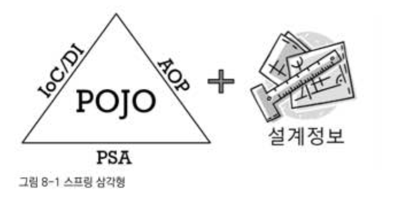

# 8장. 스프링이란 무엇인가?

[https://www.notion.so/8-4a88fa46e7fd47388c2cec6e0157e0d6](https://www.notion.so/8-4a88fa46e7fd47388c2cec6e0157e0d6)

스프링은 단순히 Ioc/DI를 편하게 적용하도록 돕는 단계를 넘어서 엔터프라이즈 애플리케이션 개발의 전 영역에 걸쳐 다양한 종류의 기술에 관여한다.

# 8.1 스프링의 정의

"자바 엔터프라이즈 개발을 편하게 해주는 오픈소스 경량급 애플리케이션 프레임워크"

- **애플리케이션 프레임워크**

애플리케이션 프레임워크는 특정 계층이나, 기술, 업무 분야에 국한되지 않고 애플리케이션의 전 영역에 포괄하는 범용적인 프레임워크를 말한다.

애플리케이션 프레임워크는 애플리케이션 개발의 전 과정을 빠르고 편리하며 효율적으로 진행하는 데 일차적인 목표를 두는 프레임워크다.

스프링을 처음 만든 사람 : 자바개발자 로드존슨

- **경량급**

스프링은 20여개의 모듈로 세분화되고 수십만 라인에 달하는 코드를 가진 매우 복잡하고 방대한 규모의 프레임워크이다. 그럼에도 경량급이라는 용어가 쓰인 이유는

EJB 같은 과도한 엔지니러잉이 적용된 기술과 스프링을 대비시켜 설명하려고이다.

스프링은 가장 단순한 서버 환경인 톰캣(Tomcat)이나 제티(Jetty)에서도 완벽하게 동작한다.

스프링의 장점은 그런 가볍고 단순한 환경에서도 복잡한 EJB와 고가의 WAS를 갖춰야만 가능했던 엔터프라이즈 개발의 고급 기술을 대부분 사용할 수 있다는 점이다.

스프링은 EJB에 비해 군더더기 없이 깔끔한 기술이란 점에서 경량급이라는 단어가 사용되었다.

- **자바 엔터프라이즈 개발을 편하게**

스프링은 근본적인 부분에서 엔터프라이즈 개발의 복잡함을 제거해내고 진정으로 개발을 편하게 해주는 해결책을 제시한다.

단순히 편리한 몇 가지 도구나 기능을 제공해주는 차원이 아니다.

엔터프라이즈 개발의 근본적인 문제점에 도전해서 해결책을 제시한다는 것이 기존 기술의 접근 방법과 스프링의 점근방법의 차이점이다.

- **오픈소스**

오픈소스란, 말 그대로 소스가 모두에게 공개되고, 특별한 라이선스를 취득한 필요없이 얼마든지 가져다 자유롭게 이용해도 된다는 뜻이다.

스프링은 로드존슨을 비롯해 유겐휠러와 자바 엔터프라이즈 세계에서 손꼽히는 최상급 개발자들이 주축이 돼서 만든 회사인 스프링소스에서 오픈소스 개발 모델과 오픈소스 라이선스를 가지고 개발되는 중이다.

# 8.2 스프링의 목적

## 8.2.1 엔터프라이즈 개발의 복잡함

### 복잡함의 근본적인 이유

- **첫번째는 기술적인 제약조건과 요구사항이 늘어가기 때문이다.**

엔터프라이즈 시스템이란, 서버에서 동작하며 기업과 조직의 업무를 처리해주는 시스템을 말한다.

엔터프라이즈 시스템은 많은 사용자들의 요청을 동시에 처리해야 하기 때문에 서버의 자원을 효율적으로 공유하고 분배해서 사용할 수 있어야 한다.

보안과 안정성, 확장성 면에서도 뛰어나야 한다.

그에 따라 시스템 설계자와 개발자 개개인이 져야 할 기술적인 부담은 점점 더 커져갔다.

- **두번째는 엔터프라이즈 애플리케이션이 구현해야 할 핵심기능인 비즈니스 로직의 복잡함이 증가하기 때문이다.**

### 복잡함을 가중시키는 원인

## 8.2.2 복잡함을 해결하려는 도전

### 제거될 수 없는 근본적인 복잡함

문제는 비즈니스 로직의 복잠함을 효과적으로 다루기 위한 방법과 기술적인 복잡함을 효과적으로 처리하는 데 적용되는 방법이 다르다는 점이다.

따라서 가장 먼저 할 일은 성격이 다른 이 두가지 복잡함을 분리해내는 것이다.

### 실패한 해결책:EJB

### 비 침투적인 방식을 통한 효과적인 해결책: 스프링

침투적인 기술 : EJB처럼 어떤 기술을 적용했을 때 그 기술과 관련된 코드나 규약 등이 코드에 등장하는 경우

비 침투적인 기술: 기술의 적용 사실이 코드에 직접 반영되지 않는 다는 특징.

어딘가에는 기술의 적용에 따라 필요한 작업을 해줘야 하겠지만, 애플리케이션 코드 여기저기에 불쑥 등장하거나, 코드의 설계와 구현 방식을 제한하지 않는다.

스프링이 성공할 수 있었던 비결은 바로 비침투적인 기술이라는 전략을 택했기 때문이다.

## 8.2.3 복잡함을 상대하는 스프링의 전략

스프링의 기본적인 전략은 비즈니스 로직을 담은 애플리케이션 코드와 엔터프라이즈 기술을 처리하는 코드를 분리시키는 것

### 기술적 복잡함을 상대하는 전략

### 첫 번째 문제 : 기술에 대한 접근 방식이 일관성이 없고, 특정 환경에 종속적이다.

환경이 바뀌고, 서버가 바뀌고, 적용되는 조건이 바뀌면 적용하는 기술이 달라지고 그에 따라 코드도 바뀐다는 건 심각한 문제다.

이렇게 일관성 없는 기술과 서버 환경의 변화에 대한 스프링의 공략 방법은 서비스 추상화다.

ex) 트랜잭션 추상화, OXM 추상화, 데이터 액세스에 관한 일관된 예외변환 기능, 데이터 액세스 기술에 독립적으로 적용 가능한 트랜잭션 동기화 기법

기술적인 복잡함은 일단 추상화를 통해 로우레벨의 기술 구현 부분과 기술을 사용하는 인터페이스를 분리하고, 환경과 세부 기술에 독립적인 접근 인터페이스를 제공하는 것이 가장 좋은 해결책이다.

### 두 번째 문제 : 기술적인 처리를 담당하는 코드가 성격이 다른 코드에 섞여서 등장한다.

ex) 트랜잭션, 비즈니스로직에 대한 보안적용, 계층 사이에 주고받는 데이터, 예외의 일괄 변환, 로깅, 감사(audit) 등

→ 이러한 문제의 해결책 : AOP

AOP 

: 최후까지 애플리케이션 로직을 담당하는 코드에 남아 있는 기술 관련 코드를 깔끔하게 분리해서 별도의 모듈을 관리하게 해주는 강력한 기술

### 비즈니스와 애플리케이션 로직의 복잡함을 상대하는 전략

기술적인 코드, 침투적인 기술이 가져온 불필요한 흔적을 제거하고 나면 순수하게 애플리케이션의 주요 기능과 비즈니스 로직을 담은 코드만 독립적으로 존재하게 된다.

**비즈니스 로직을 담은 코드** :  애플리케이션에서 가장 핵심이 되는 부분이다. 또한 업무의 변화에 따라 자주 변경되거나 수정되는 부분이기도 하다.

**DB에서 비즈니스 로직을 처리하게 되는 것에 대한 문제점**

- 불편하고 위험
- 확장하기 힘들고 많은 비용이 듬
- DB에 부담이 감
- 데이터 액세스 중심으로 로직을 다루면 개발과 유지보수는 물론이고 테스트도 어렵다

→ 비즈니스 로직은 **애플리케이션 안에서 처리하도록 만드는 추세**이다.

: 데이터를 분석하고 가공하고 그에 따라 로직을 처리하는 부분은 확장하기 쉽고, 비용도 싼 애플리케이션 서버쪽으로 이동하는 것. 

**<장점>**

- CBD를 비롯한 최신 설계와 개발 기법, 모델링을 중심으로 한 개발 방법이 오브젝트 기반 설계와 구현에 잘 들어 맞는다.
- 객체지향 분석과 설계(OOAD)를 통해서 작성된 모델을 코드로 구현하고 지속적으로 발전시킬 수도 있다.

### 핵심 도구 : 객체지향과 DI

**객체지향**:  기술과 비즈니스 로직의 복잡함을 해결하는 데 스프링이 공통적으로 사용하는 도구.

**스프링의 기본전략** : 자바의 기본인 객체지향에 충실한 설계가 가능하도록 단순한 오브젝트로 개발할 수 있고, 객체지향의 설계 기법을 작 저용할 수 있는 구조를 만들기 위해 DI같은 유용한 기술을 편하게 적용하도록 도와주는 것

# 8.3 POJO 프로그래밍

스프링의 핵심 : 스프링의 정수(essence)는 엔터프라이즈 서비스 기능을 POJO에 제공하는 것.

→ 분리됐지만 반드시 필요한 엔터프라이즈 서비스 기술을 POJO 방식으로 개발된 애플리케이션 핵심 로직을 담은 코드에 제공한다는 것.

## 8.3.1 스프링의 핵심 : POJO

아드리안 콜리어가 스프링의 핵심 개념을 설명하기 위해 만든 그림.

애플리케이션을 POJO로 개발할 수 있게 해주는 가능 기술 3가지

- IOC/DI
- AOP
- PSA

## 8.3.2 POJO란 무엇인가?

**POJO(Plain Old Java Object) : 자바의 단순한 오브젝트** 

## 8.3.3 POJO의 조건

- 특정 규약에 종속되지 않는다. : POJO는 자바 언어와 꼭 필요한 API외에는 종속되지 않아야 한다. → 다른 규약에 종속되지 않고, 객체지향 설계의 자유로운 적용이 가능한 오브젝트여야만 POJO라고 불릴 수 있다.
- 특정 환경에 종속되지 않는다. : POJO는 환경에 독립적이여야 한다. 특히 비즈니스 로직을 담고 있는 POJO 클래스는 웹이라는 환경정보나 웹 기술을 담고 있는 클래스나 인터페이스를 사용해서는 안 된다.

 

      * 어노테이션을 사용했을 경우 POJO가 아닐까?
    
        : 어노테이션이 단지 코드로 표현하기는 적절치 않는 부가적인 정보를 담고 있고, 그 때문에 환경에 종속되지
    
          만 않는다면 여전히 POJO라고 할 수 있다. 하지만 어노테이션이나 엘리먼트 값에 특정 기술과 환경에 종속
    
          적인 정보를 담고 있다면 그때는 POJO로서의 가치를 잃어버린다고 할 수 있다.

- 객체지향적인 자바 언어의 기본에 출실하게 만들어져야 한다. : 자바는 객체지향 프로그래밍을 가능하게 해주는 언어이지만, 자바 언어 문법을 사용했다고 해서 자동으로 객체지향 프로그래밍과 객체지향 설계가 적용됐다고 볼 수는 없다.

진정한 POJO란 객체지향적인 원리에 충실하면서, 환경과 기술에 종속되지 않고 필요에 따라 재활용될 수 있는 방식으로 설계된 오브젝트를 말한다. 그런 POJO에 애플리케이션의 핵심 로직과 기능을 담아 설계하고 개발하는 방법을 POJO 프로그래밍이라고 할 수 있다.

## 8.3.4 POJO의 장점

- 특정한 기술과 환경에 종속되지 않는 오브젝트는 그만큼 깔끔한 코드가 될 수 있다.
- POJO로 개발된 코드는 자동화된 테스트에 매우 유리하다.
- 객체지향적인 설계를 자유롭게 적용할 수 있다는 것

## 8.3.5 POJO 프레임워크

: POJO 프로그래밍이 가능하도록 기술적인 기반을 제공하는 프레임워크 ex) 스프링,하이버네이트

스프링은 엔터프라이즈 애플리케이션 개발의 모든 영역과 계층에서 POJO 방식의 구현이 가능하게 하려는 목적

: 비즈니스로직의 복잡함과 엔터프라이즈 기술의 복잡함을 분리해서 구성할 수 있게 도와준다. 하지만 자신은 기술영역에만 관여하지 비즈니스 로직을 담당하는 POJO에서는 모습을 감춘다. → POJO로 쉽게 개발할 수 있게 지원

# 8.4 스프링의 기술

:스프링 프레임워크가 만들어진 진정한 목표인 POJO 기반 엔터프라이즈 개발을 편리하게 해주는 도구 

POJO 프로그래밍을 손쉽게 할 수 있도록 스프링이 지원하는 세가지 기술 

- IOC/DI
- AOP
- PSA

## 8.4.1 제어의 역전(IOC) / 의존관계 주입(DI)

: 스프링의 가장 기본이 되는 기술이자 스프링의 핵심 개발 원칙 : 나머지 두 기술에도 바탕이 된다.

- 유연한 확장 가능
- DI는 개방폐쇄원칙(OCP)로 잘 설명될 수 있다. → 변경에는 닫혀 있으며 재 사용이 가능하다.

### DI 활용 방법

**DI의 장점**

- 핵심 기능의 변경

      : DI의 가장 대표적인 적용 방법은 바로 의존 대상의 구현을 바꾸는 것. → 전략 패턴
    
        A→B 구조에서, B의 구현 방식을 통째로 B1,B2,B3로 바꾸는 것이다. 
    
       ex) DAO의 구현을 JDBC로 했다가, JPA, 하이버네이트, JDO, iBatis 등으로 변경하는 것
    
      : 이렇게 실제 의존하는 대상이 가진 핵심기능을 DI 설정을 통해 변경하는 것이 대표적인 활용방법이다.

- 핵심기능의 동적인 변경

      : 의존 오브젝트의 핵심 기능 자체를 바꾸는 것이다. → DI는 애플리케이션이 동작하는 중간에 그 의존 대상을 다이내믹하게 변경할 수 있게 해준다.
    
      : 동적인 방식으로 핵심 기능을 변경하는 건, 기술적으로 보자면 다이내믹 라우팅 프록시나 프록시 오브젝트 기법을 활용한 것이다. 그런 기법또한 DI가 바탕이다.

- 부가기능의 추가

       : 핵심 기능은 그대로 둔 채로 부가기능을 추가하는 것이다. → 데코레이터 패턴
    
       : 인터페이스를 두고 사용하게 하고, 실제 사용할 오브젝트는 외부에서 주입하는 DI를 적용해두면 데코레이터 패턴을 쉽게 적용할 수 있다.
    
       : 때로는 핵심기능은 그대로 둔 채로 결과나 전달 파라미터를 조작할 수도 있고, 파라미터나 리턴 결과를 활용해 로깅이나 보안처리 같은 부가적인 작업을 수행할 수도 있다.

   → DI의 핵심 원칙인 OCP에도 잘 들어맞는다.

- 인터페이스의 변경

     : 클라이언트가 사용하는 인터페이스와 실제 오브젝트 사이에 인터페이스가 일치하지 않는 경우에 사용

       B인터페이스를 사용하도록 만들어진 A를, B를 내부에서 C를 호출하는 기능을 가진 어댑터로 만들어

       A에게 DI해주는 방식 → 오브젝트 방식의 어댑터 패턴의 응용

     

- 프록시

       : 필요한 시점에서 실제 사용할 오브젝트를 초기화하고 리소스를 준비하게 해주는 지연로딩을 적용하려면 프록시가 필요하다. 원격 오브젝트를 호출할 때 마치 로컬에 존재하는 오브젝트 처럼 사용할 수 있게 해주는 원격 프록시를 적용하려고 할 때도 프록시가 필요하다.

스프링은 EJB 원격 호출을 포함해서 웹서비스, REST 호출, HTTP 방식의 호출 등 다양한 리모팅 기술을 지원한다.

- 템플릿과 콜백
- 싱글톤과 오브젝트 스코프
- 테스트 : ex) 목 오브젝트

### 8.4.2 에스펙트 지향 프로그래밍(AOP)

### AOP 적용기법

- 스프링과 같이 다이내믹 프록시를 사용하는 방법  : 스프링의 기본적인 AOP 구현 방법
- 자바이 언어의 한계를 넘어서는 언어의 확장을 이용하는 방법 : AspectJ 사용(다양한 조인 포인트, 메소드 호출, 인스턴스 생성, 필드액세스, 특정 호출 경로를 가진 메소드 호출 등에도 부가기능 제공)

### AOP 적용 단계

- AOP 적용 1단계 : 미리 준비된 AOP 이용 ex) 트랜잭션, @configurable
- AOP 적용 2단계 : 전담팀을 통한 정책 AOP 적용 : 개개인의 개발자들은 이용불가
- AOP 적용 3단계 : AOP의 자유로운 이용 : 개개인의 개발자들도 이용

### 8.4.3 포터블 서비스 추상화(PSA)

PSA(Portable Service Abstraction) : 일관성 있는 서비스 추상화 기술

: 환경과 세부 기술의 변화에 관계없이 일관된 방식으로 기술에 접근할 수 있도록 해준다.

스프링이 엔터프라이즈 개발에 사용되는 다양한 기술에 대한 서비스 추상화 기능을 제공한다.