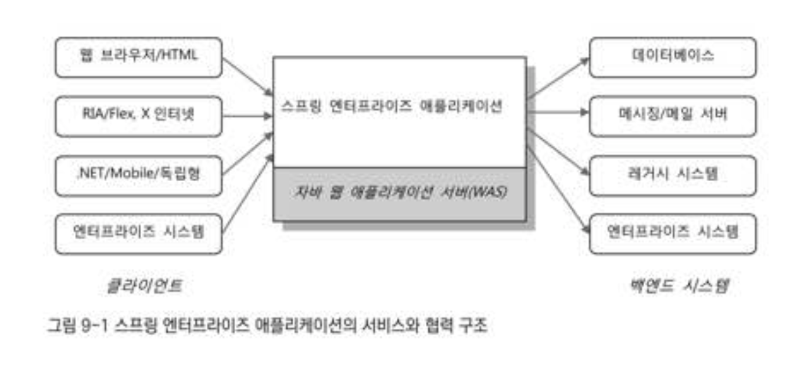

# 9장. 스프링 프로젝트 시작하기

[https://www.notion.so/9-02a2c8315b034df08089fc4c1de3bbe6](https://www.notion.so/9-02a2c8315b034df08089fc4c1de3bbe6)

# 9.1 자바 엔터프라이즈 플랫폼과 스프링 애플리케이션

## 9.1.1 클라이언트와 백엔드 시스템

백엔드 시스템 : 데이터 베이스나 레거시 시스템 같은 엔터프라이즈 정보 시스템(EIS)

스프링 엔터프라이즈 애플리케이션이 이용하는 백엔드 시스템으로는 DB는 물론이고 메시징 서버, 메일 서버, 메인프레임도 가능하다. 제공하는 접속 방식을 지원하는 시스템이면 된다. 웹 서비스를 제공하는 서버도 자주 사용된다..

## 9.1.2 애플리케이션 서버

스프링으로 만든 애플리케이션을 자바 서버환경에 배포하려면 JavaEE 서버가 필요하다.

JavaEE 표준을 따르는 애플리케이션 서버는 크게 두 가지로 구분할 수 있다.

- 웹 어플리케이션 서버 WAS :  JavaEE 의 대부분의 표준 기술을 지원하고 다양한 형태의 모듈로 배포가 가능
- 경량급 WAS 또는 서블릿/JSP 컨테이너 : 웹 모듈의 배포만 가능

### 경량급 WAS/서블릿 컨테이너

: 스프링은 기본적으로 톰캣이나 제티 같은 가벼운 서블릿 컨테이너만 있어도 충분하다. 

EJB나 리소스 커넥터, WAS가 제공하는 분산 서비스등이 굳이 필요하지 않다면 서블릿 컨테이너로도 엔터프라이즈 애플리케이션에 필요한 핵심기능을 모두 이용할 수 있다.

기존에 EJB와 WAS를 사용해야 가능했던 선언적인 트랜잭션이나 선언적 보안, DB 연결 풀링, 리모팅이나 웹 서비스는 물론이고 추가적인 라이브러리의 도움을 받으면 분산/글로벌 트랜잭션까지도 가능하다.

### WAS

: 미션 크리티컬한 시스템에서 요구하는 고도의 안정성, 고성능 시스템에서 필수적인 안정적인 리소스 관리, 레거시 시스템의 연동이나 기존 EJB로 개발된 모듈을 함께 사용하는 등의 필요가 있다면 상용 또는 오픈소스 WAS를 이용할 수 있다. 

무엇보다도 자바 엔터프라이즈 버전(JAVAEE) 표준을 최대한 활용할 수 있다.

### 스프링 소스 TcServer

: 실제로 개발환경과 운영환경에서 가장 많이 사용되는 자바 서버는 웹 모듈만 지원하는 서블릿 컨테이너인 아파치 **톰캣을 기반으로 만든 엔터프라이즈 스프링 에플리케이션에 최적화된 경량급 애플리케이션 서버** 

가장 큰 장점은 스프링 애플리케이션 개발과 우녕에 꼭 필요한 중요한 기능이 많이 제공된다는 점.

## 9.1.3  스프링 애플리케이션의 배포단위

- 독립 웹 모듈 : 스프링은 보통 war로 패키징된 독립 웹 모듈로 배포된다.
- 엔터프라이즈 애플리케이션 : 확장자가 ear인 엔터프라이즈 애플리케이션으로 패키징해서 배포
- 백그라운드 서비스 모듈 : rar 패키징 방법 : 리소스 커넥터를 만들어 배포할 때 사용하는 방식

# 9.2 개발도구와 환경

## 9.2.1 JavaSE와 JavaEE

### JavaSE/JDK

스프링 3.0 → JDK5.0 이상 필요.

JDBC4.0 → JDK6.0 이상 필요

### JavaEE/J2EE

스프링 3.0 → J2EE1.4 or JavaEE 5.0 필요

## 9.2.2 IDE

: 개발 과정에서 필요한 모든 일을 처리할 수 있도록 만들어진 통합 개발 환경

: ANT나 Maven 같은 빌드 툴을 지원하고 톰캣이나 자바 서버로 바로 배포해서 실행해볼 수 있는 환경

ex) 이클립스, 넷빈즈, IntelliJ

## 9.2.3 SpringSource Tool Suite(STS)

: 이클립스의 확장판

: 최신 이클립스를 기반으로 주요한 스프링 지원 플러그인과 관련 도구를 모아서 스프링 개발에 최적화되도록 만들어진 IDE

### SpringIDE 플러그인

: 스프링 개발에 유용한 기능을 제공하는 플러그인 모음

**기능**

- 빈 클래스 이름 자동완성 : 요약어를 입력하고 ctrl + space Bar
- 빈 설정 오류 검증 : XML파일 설정에서 잘못된 클래스 이름을 넣거나, 잘못된 프로퍼티를 지정하면 오류마크를 보여줌
- 프로젝트 생성, 설정파일 생성, 빈 등록 위저드
- 빈 의존 관계 그래프 : 각 빈이 서로 어떻게 참조하고 있는지, 어떤 프로퍼티를 갖고 있는지를 한눈에 볼 수 있는 그래프를 그려준다.
- AOP 적용 대상 표시 : 포인트컷이 적용되는 대상 빈을 설정파일 안에서 한눈에 볼 수 있도록 지원해준다.
- 기타 지원 기능

### STS 플러그인

: 스프링 개발과 설정파일 편집을 지원하는 SpringIDE에 더해서 스프링 애플리케이션의 서버배치와 같은 추가 기능을 제공.

**배치 지원가능 스프링서버**

- 최신 JavaEE서버
- 스프링에 최적화된 애클리케이션 서버 tcServer
- OSGi 플랫폼 dmServer
- 스프링기반 클라우드 서비스인 스프링소스 Cloude Foundry (아마존 EC2클러스터에서 동작)
- VMForce와 같은 VMWare 가상화 클라우드 서비스

### 기타 플러그인

- M2Eclipse
- AJDT
- VMCI
- 이클립스 표준 플러그인

## 9.2.4 라이브러리 관리와 빌드 툴

### 라이브러리 관리의 어려움

자바에는 모듈이라는 개념이 없다.

라이브러리 의존관계를 따져봤을 때 버전문제가 발생할 수 있다.

이럴 때 재패키징을 이용해야 한다.

: 구글코드에서 찾을 수 있는 jarjar를 이용하면 간단한 명령으로 한번에 복잡한 라이브러리 클래스를 모두 재패키징할 수 있다.

### 라이브러리 선정

### 빌드툴과 라이브러리 관리

Maven과 ANT는 자바의 대표적인 빌드 툴

: 자동빌드 기능을 지원한느 IDE를 기본적으로 이용하면서 ANT나 Maven같은 환경에 독립적인 빌드 툴을 함께 사용하는 것이 바람직하다.

POM : 의존정보에 하나 라이브러리를 지정하면, 지정된 라이브러리가 동작하는데 필요한 여타 라이브러리까지 함께 다운로드해주는 기능을 가졌다.

# 9.3 애플리케이션 아키텍처

**아키텍처** : 어떤 경계 안에 있는 내부 구성요소들이 어떤 책임을 갖고 있고, 어떤 방식으로 서로 관계를 맺고 동작하는 지를 규정하는 것.

: 단순히 정적인 구조를 나타내는 것으로만 생각하기 쉽지만 실제로는 그 구조에서 일어나는 동적인 행위와 깉은 관계가 있다.

## 9.3.1 계층형 아키텍처

### 아키텍처와 SoC

**계층형 아키텍처** : 책임과 성격이 다른 것을 크게 그룹으로 만들어 분리해두는 것을 아키텍처 차원에서 부르는 말.

또는 티어(계층)이라는 용어를 써서 **멀티티어아키텍처**라고 한다. 

### 3계층 아키텍처와 수직 게층

데이터 액세스 계층: 백엔드의 DB나 레거시 시스템과 연동하는 인터페이스 역할

서비스 계층: 비즈니스로직을 담고 있는

프레젠테이션 계층: 주로 웹기반의 UI를 만들어내고 그 흐름을 관리하는

- 데이터 액세스 계층 : DAO 계층

: DAO 패턴을 보편적으로 사용, DB,ERP,레서시시트메, 메인프레임등에 접근하는 역할

: EIS(Enterprise Information System) 계층

: 외부시스템을 호출해서 서비스를 이용하는 것.(기반 계층)

- 서비스 계층

: 원칙적으로 서비스 계층 코드가 기반 서비스 계층의 구현에 종속되면 안된다.

서비스 계층의 코드는 추상화된 기반 서비스 인터페이스를 통해서반 접근하도록 만들어서 특정구현과 기술에 대한 종속성을 제거해야 한다. 또는 AOP를 통해서 서비스 계층 코드를 침범하지 않고 부가기능을 추가하는 방법을 활용해야 한다.

이상적인 서비스 계층은 다른 계층이 바귀어도 그대로 유지될 수 있어야 한다.

엔터프라이즈 애플리케이션에서 가장 중요한 자산은 도메인의 핵심 비즈니스 로직이 들어 있는 서비스 계층이어야 한다.

- 프레젠테이션 계층

: 클라이언트 종류와 상관없이 HTTP 프로토콜을 사용하는 서블릿이 바탕이 된다.

### 계층형 아키텍처 설계의 원칙

: 어떤 경우라도 계층 사이의 낮은 결합도를 깨트리지 않도록 설계해야 한다. 당연히 계층사이의 호출은 인터페이스를 통해 이뤄져야 한다. 인터페이스를 사용하게 한다는 건 각 계층의 경게를 넘어서 들어오는 요청을 명확히 정의하겠다는 의미다.

## 9.3.2 애플리케이션 정보 아키텍처

엔터프라이즈 시스템 : 본질적으로 동시에 많은 작업이 빠르게 수행되어야 하는 시스템

### DB/SQL 중심의 로직 구현 방식

특징 :  하나의 업무 트랜잭션에 모든 계층의 코드가 종속되는 경향이 있다.

장점 :

- 개발하기 쉽다. 적어도 처음에는 그렇다.
- 익숙하고 편하다

단점 :

- 자바코드를 단지 DB와 웹 화면을 연결해주는 단순한 인터페이스 도구로 전락시키는 것.
- JDBC를 이용해 DB 기능을 사용하게 하는 스크립트 정도로 역할이 축소된다.
- 변화에 매우 취약하다
- 객체지향의 장점이 별로 활용되지 못한다. 각 계층의 코드가 긴밀하게 연결되어 있기 때문이다.

### 거대한 서비스 계층 방식

특징 :  DB에는 부하가 걸리지 않도록 저장 프로시저의 사용을 자제하고 복잡한 SQL을 피하면서, 주요 로직은 서비스 계층의 코드에서 처리하도록 만드는 것.

DAO와 SQL은 상대적으로 단순해지고, 그중 일부는 여러 서비스 계층 코드에서 재 사용이 가능해진다.

데이터 액세스 계층이나 DB는 비즈니스 로직을 직접 담고 있지 않기 때문에 이전보다 가벼워 진다. = 서비스 계층은 두터워진다.

장점 :  

- 애플리케이션 코드에 비즈니스 로직이 담기기 때문에 자바 언어의 장점을 활용해 로직을 구현할 수 있다.
- 테스트가 수월하다.
- DAO가 다루는 SQL이 복잡하지 않고 프레젠테이션 게층의 뷰와 1:1로 매핑이 되지 않아도 되기때문에 일부 DAO코드는 여러 비즈니스 로직에서 공유해서 사용할 수 있다.
- 초기 개발 속도가 빠르고, 개발자 사이에 간섭없이 독립적인 개발이 가능하다.

단점 :

- 계층간의 결합도가 여전히 크다.
- 서비스 계층에서 비슷한 기능의 코드가 여러 메소드에서 중복돼서 나타나기 쉽다.
- 본격적인 객체지향적 설계를 적용하기 힘들다.
- 개발자 개개인의 코딩습관이나 실력에 따라서 비슷한 로직이더라도 전혀 다른 스타일의 코드가 나오기 쉽상이다.
- 개발 능력이 떨어지는 경우에는 자바코드로 구현한 비즈니스 로직이 복잡한 SQL보다 더 이해하기 힘들 수도 있다.
- 계층별로 독립된 설계와 개발이 어렵다
- 설계에 변경이 생기거나 유지보수 중 수정할 필요가 있을 경우 코드를 손대기가 쉽지 않다.

## 9.3.3 오브젝트 중심 아키텍처

: 도메인 모델을 반영하는 오브젝트 구조를 만들어두고 그것을 각 계층 사이에서 정보를 전송하는데 사용한다.

: 객체지향 분석과 모델링의 결과로 나오는 도메인 모델을 오브젝트 모델로 활용한다.

: 오브젝트를 만들어두고 오브젝트 구조 안에 정보를 담아서 각 계층 사이에 전달하게 만드는 것.

### 데이터와 오브젝트

### 도메인 오브젝트를 사용하는 코드

- 오브젝트 중심 방식에서 비즈니스 로직 구현이 간단하고 명확하다.
- 오브젝트 구조로 정보를 갖고 있으면 어떤 식으로든 활용하기 편리하다.
- 자바에서는 '.'을 이용해 레퍼런스 변수를 따라가면 관련된 정보를 손쉽게 이용할 수 있다.
- 도메인 오브젝트를 사용하는 코드는 간단히 테스트 값을 담은 도메인 오브젝트를 생성해서 쉽게 검증할 수 있다.
- 코드는 이해하기 쉽고 로직을 작성하기도 수월하다
- 코드 재사용성은 높아지고 DAO는 더 작고 효율적으로 만들어질 수 있다.

도메인 오브젝트 사용의 문제점

- 최적화된 SQL을 매번 만들어 사용하는 경우에 비해 성능 면에서 조금은 손해를 감수해야 할 수도 있다.
- 오브젝트 관계에도 상당한 낭비가 발생할 수 있다.

→ 지연적 로딩기법이 필요하다. → JPA,JDO,하이버네이트,TopLinK와 같은 오브젝트/RDB매핑 기술을 사용해서 그들이 제공해주는 지연된 로딩기법을 활용해서 최적화해야 한다.

또는 ORM이 제공하는 오브젝트 캐시를 이용할 수도 있다.

> 오브젝트 중심 아키텍처는 도메인 모델을 따르는 오브젝트를 사용해 각 계층 사이에 정보를 전달하고, 이를 활용해 비즈니스 로직이나 프레텐 테이션 로직을 작성한다. 계층 간의 결합도는 낮아지고 일관된 정보 모델을 사용하기 때문에 개발 샌상성과 코드의 품질, 테스트 편의성도 향상 시킬 수 있다.

### 빈약한 도메인 오브젝트 방식

: 정보만 담겨 있고, 정보를 활용하는 아무런 기능도 갖고 있지 않은 오브젝트 : 데이터 중심 아키텍처의 거대한 서비스 계층구조와 비슷하다.

### 풍성한 도메인 오브젝트 방식(영리한 도메인 오브젝트)

도메인 오브젝트의 객체지향적인 특징을 잘 사용할 수 있도록 개선한 것.

비즈니스 로직은 특정 도메인 오브젝트나 그 관련 오브젝트가 가진 정보와 깊은 관계가 있다.

해당 오브젝트와 긴밀한 연관관계를 맺고, 해당 오브젝트의 정보와 기능만들 활용하는 코드를 서비스 계층 코드가 아니라 도메인 오브젝트에 넣어주고, 서비스 계층의 비즈니스 로직에서 재사용하게 만드는 것.

: 이렇게 도메인 오브젝트 안에 로직을 담아두면 이 로직을 서비스 계층의 메소드에 따로 만드는 경우보다 응집도가 높다.

- 객체지향적이다.
- 정적인 구조뿐ㅇ ㅏ니라 동적인 동작 방식에도 적극 활용할 수 있다.
- 비즈니스 로직 코드를 이해하기도 쉽다.

**왜 도메인 오브젝트는 DAO 오브젝트를 DI받을 수 없을까?**
그것은 도메인 오브젝트는 스프링 컨테이너가 관리하는 오브젝트, 즉 빈이 아니기 때문이다.
서비스 계층의 오브젝트나 데이터 액세스 계층의 오브젝트는 모두 스프링의 빈으로 등록되기 때문에 필요에 따라 서로 DI할 수 있다. DI를 받으려면 자신도 역시 스프링 컨테이너에서 관리되는 빈이어야 한다.

### 도메인 계층 방식

: 도메인 오브젝트들이 하나의 독립적인 계층을 이뤄서 서비스 계층과 데이터 액세스 계층의 사이에 존재하게 하는 것.

기존과 다른 두가지 특징

- 도메인 종속적인 비즈니스 로직의 처리는 서비스 계층이 아니라 도메인 계층의 오브젝트 안에서 진행된다는 점
- 도메인 오브젝트가 기존 데이터 액세스 계층이나 기반 계층의 기능을 직접 활용할 수 있다는 것

## 9.3.4 스프링 애플리케이션을 위한 아키텍처 설계

### 계층형 아키텍처

- 3계층이라는 것은 논리적이고 개념적인 구분이지 꼭 오브젝트 단위로 딱 끓어져서 만들어지는게 아님을 염두에해둬야 한다.
- CRUD만 있는 애플리케이션이라면 서비스 계층을 데이터 액세스 계층에 통합하는 것도 나쁘지 않다.
- 요즘은 프레젠테이션 계층은 특히 그 경계를 애플리케이션이 배치된 서버를 떠나서 클라이언트까지 확장하기도 한다. (SOFEA 아키텍처)

### 서드파티 프레임워크, 라이브러리 적용

스프링이 지원하는 기술이란?

- 해당 기술을 스프링의 DO 패턴을 따라 사용할 수 있다.
- 스프링의 서비스 추상화가 적용됐다.
- 스프링이 지지하는 프로그래밍 모델을 적용했다.
- 템플릿/콜백이 지원된다.